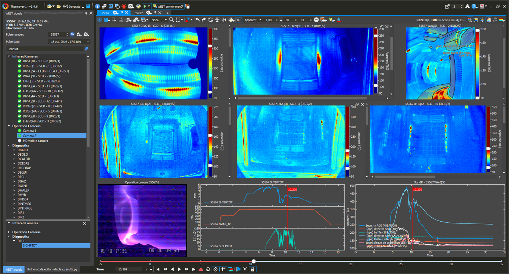

# Thermavip

[CEA-IRFM](http://irfm.cea.fr/en/index.php) has gained in-depth expertise at using imaging diagnostics to understand quick-ageing and damaging of materials under high thermal stresses. This knowledge has been used to developp the ThermaVIP (*Viewing Imaging Platform*) software platform, initially designed for the exploitation of infrared thermography diagnostics in fusion tokamaks. This software platform, which required 8 years of development, is made up of a set of modules allowing the exploitation of imaging diagnoses in a complex measuring environments.

Thermavip is mainly dedicated to operational safety, quality control and comprehension of high-temperature processes in several fields. It is currently used for offline and real-time analaysis of multi-sensor data in tokamaks.

For offline diagnostic data analysis, Thermavip provides tools for:

* Data browsing/searching based on a database of signals,
* Synchronization and visualization of heterogeneous sensor data (images, videos, 1D + time signals,...),
* Extracting statistics within videos/signals,
* Applying predefined/custom processings to videos/signals,
* Performing signal fusion processings,
* Recording any kind of sensor/processed data to share with partners.

For real-time exploitation of sensor data, Thermavip provide tools for:

* Defining asynchronous processing pipelines on distributed architectures,
* Recording any kind of sensor data within a single or multiple archives,
* Online/multiscreen displaying of several videos and temporal signals,

Below screenshot shows an example of software built based on Thermavip SDK for the post analysis of WEST sensor data:

Thermavip is based on a [versatile software architecture](docs/architecture.md) composed of a C++  **S**oftware **D**evelopment  **K**it (SDK) and a plugin mechanism.
The SDK itself is based on [Qt](https://www.qt.io) only, a powerfull and open source library for generic programming and Graphical User Interface. Currently, the SDK is composed of 6 libraries:

-	[Logging](docs/logging.md): logging to file/console/GUI tools
-	[DataType](docs/datatypes.md): base data types manipulated by Thermavip (N-D arrays, vector of points, scene models...)
-	[Plotting](docs/plotting.md): high performance plotting library for offline/firm real-time display of multi-sensor data
-	[Core](docs/core.md): asynchronous agents library based on dataflow, archiving, plugin mechanism
-	[Gui](docs/gui.md): base graphical components (main window, players...)
-	[Annotation](docs/annotation.md): graphical components used to annotate IR videos, upload annotations to JSON files or to a MySQL/SQLite DB, query and display annotations from a DB.

**These libraries can also be used outside of Thermavip application, like any third party library.**

Currently, Thermavip libraries are restricted to C++11 as older gcc version must be supported.

## Prerequisites

To compile and run Thermavip, you need a valid Qt installation (starting version 5.9).
Qt needs to be compiled with the desktop opengl option, and with mysql support if you wish to use the [Annotation](docs/annotation.md) library with a MySQL database.

You can download Qt source code from this [website](https://download.qt.io/archive/qt/).

Note that Thermavip will compile and run on almost any platform supporting Qt, including Windows and all Linux distributions.

Default plugins shipped within the git reprository rely on the [HDF5](https://www.hdfgroup.org/solutions/hdf5/), [CPython](https://github.com/python/cpython) and [Ffmpeg](https://ffmpeg.org/) libraries, and are NOT compiled by default.

## Compilation

Thermavip compilation relies on cmake. See this [page](docs/compilation.md) for more details.

## Authors

* [Victor MONCADA](mailto:victor.moncada@cea.fr) (victor.moncada@cea.fr)
* **Gwenael Dunand**
* **Chakib Belafdil**

The software has been built with the collaboration and intensive testing of:

* The [CEA/IRFM](http://irfm.cea.fr/en/index.php) which develops and maintains Thermavip,
* The Greifswald branch of [IPP](https://www.ipp.mpg.de/w7x) for the Wendelstein 7-X Stellarator,
* The [ITER-CODAC](https://www.iter.org/mach/Codac) team.

## Acknowledgments

Thermavip SDK and plugins are shipped with raw/modified versions of a few libraries:

* [ska_sort](https://github.com/skarupke/ska_sort) is used for fast sorting of numerical values
* The *Plotting* library of Thermavip SDK is a heavily modified version of [qwt](https://qwt.sourceforge.io/) library.
* The *Image Warping* processing uses a modified version of this [Delaunay](https://github.com/paulzfm/MSTSolver/tree/master/delaunay) library written by Ken Clarkson.

Thermavip framework and this page Copyright (c) 2023, CEA/IRFM