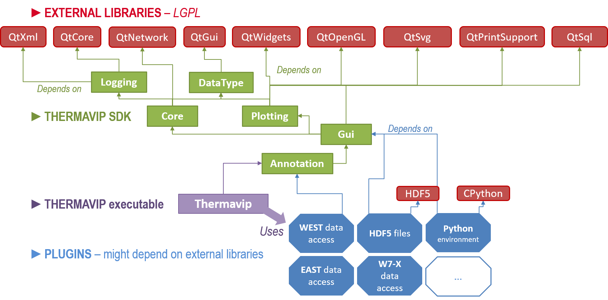

# Global architecture


Thermavip is a C++ framework based on 4 layers (see image below):

- The Qt library which is the only external dependency of Thermavip. You will need a version of Qt >= 5.9
- a Software Development Kit (SDK) composed of 6 shared libraries: 

	1.	[Logging](logging.md): logging to file/console/GUI tools
	2.	[DataType](datatype.md): base data types manipulated by Thermavip (N-D arrays, vector of points, scene models...)
	3.	[Core](core.md): asynchronous agents library based on dataflow, archiving, plugin mechanism
	4.	[Plotting](plotting.md): high performance plotting library for offline/firm real-time display of multi-sensor data
	5.	[Gui](gui.md): base graphical components (main window, players...)
	6.	[Annotation](annotation.md): graphical components used to annotate IR videos, upload annotations to JSON files or to a MySQL/SQLite DB, query and display annotations from a DB.
			
- The *plugins*, dynamic libraries containing user specific functionalities based on the SDK. These plugins generally provide tools to interact with additional data format (like new video files), display additional GUI features or define new signal processing routines. 
- The *Thermavip* executable itself, which is basically just a plugin container. Its main purpose it to setup the main GUI and load the plugins from within the *VipPlugins* directory.




A lot of Thermavip SDK functionalitites rely on Qt mechanisms : meta-object system and the property system.
It is fundamental to understand these systems if you wish to use Thermavip SDK.

Currently, Thermavip libraries are restricted to C++14 as older gcc versions must be supported.


# Naming convention


Thermavip API always follows the same naming convention which is very close to the Qt library one. The naming convention is the following:

- Classes start with the ```Vip``` prefix and each sub-part of the full name starts with an upper case letter. For instance, a class which goal is to sort a numerical sequence is called **VipSortNumericalSequence**.
- Free functions start with the ```vip``` prefix and each sub-part of the full name starts with an upper case letter. For instance, a function which goal is to sort a numerical sequence is called **vipSortNumericalSequence**.
- Function members start with a lower case letter.
- All macros use upper letters with an underscore separator and the ```VIP_``` prefix. A macro containing code sorting a numerical sequence is called **VIP_SORT_NUMERICAL_SEQUENCE**.

On top of that, the public doxygen documentation is always located in the header files. This prevents developers using only the API to continuously switch between the source code and the html documentation.


