# Gallery

This page presents examples of plots made with the *Plotting* library and link the associated source code.

## Axes

This example shows how to organize several axes around the same plotting area and what type of axis options are available. [Source code](../src/Tests/Plotting/Axes/main.cpp).

## BarChart

This example demonstrate how to quickly create a bar chart. [Source code](../src/Tests/Plotting/BarChart/main.cpp).
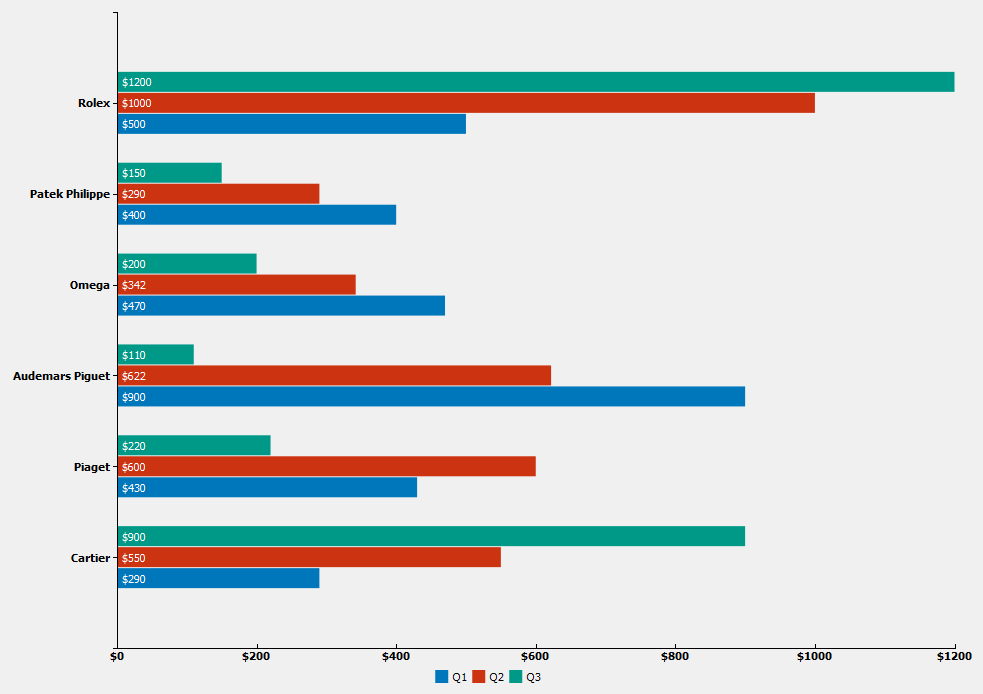

## CurveStreaming

This application shows 6 curves streaming continuously and different ways to manage the time scale. [Source code](../src/Tests/Plotting/CurveStreaming/main.cpp).
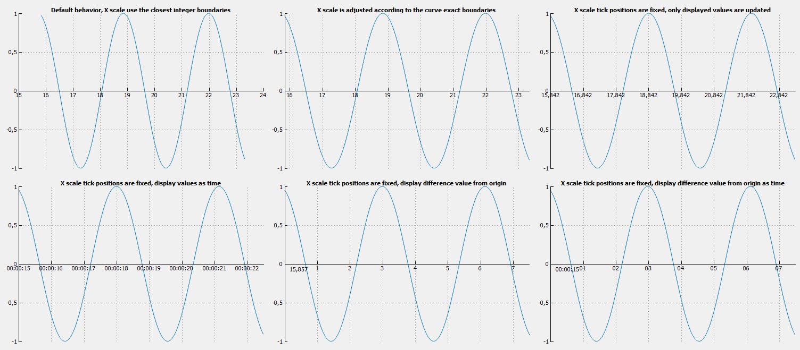

## CurveStreaming2

This application shows another example of continuously updated curves. It displays 100 curves of 10000 points each updated at around 100Hz. [Source code](../src/Tests/Plotting/CurveStreaming2/main.cpp).
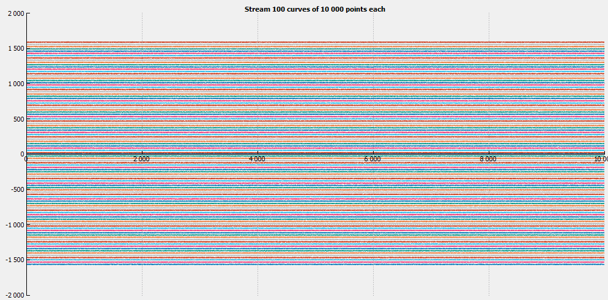

## CurveStyles

Shows the different styles and symbols used to render curves. [Source code](../src/Tests/Plotting/CurveStyles/main.cpp).

## HeavyCurveStreaming

Another example of curve streaming. This one demonstrate the rendering capabilities, as it displays around 30M points per second with a display rate of 60Hz.
It also uses a custom style sheet to modify the plotting style. [Source code](../src/Tests/Plotting/HeavyCurveStreaming/main.cpp).
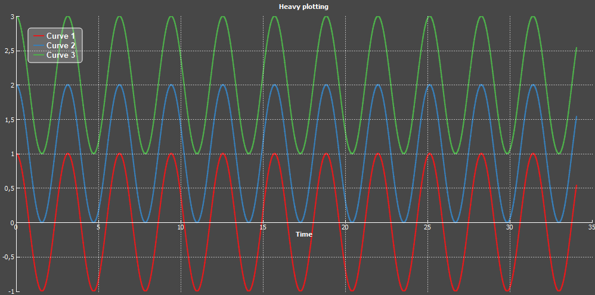

## HistogramStyles

This example displays the different histogram styles. [Source code](../src/Tests/Plotting/HistogramStyles/main.cpp).
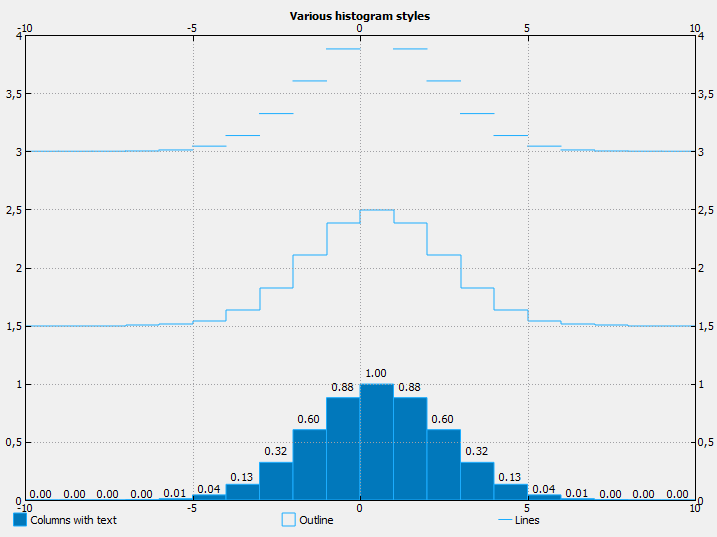

## PieChart

An example of quickly setup pie chart. [Source code](../src/Tests/Plotting/PieChart/main.cpp).
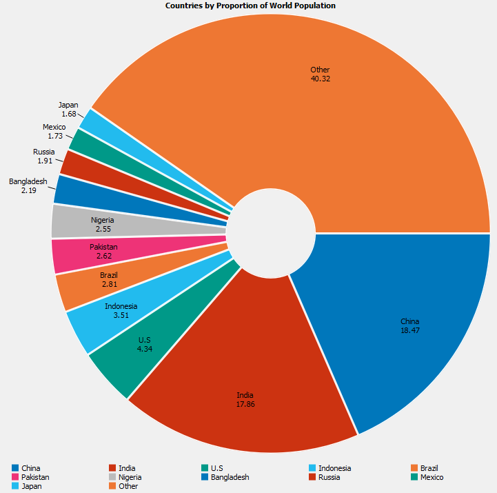

## PolarGauge

This example demonstrate the usage of a live VipPolarValueGauge widget. 
At first, this widget was developped for internal use only, but it became a good way to demonstrate how to build a custom widget using existing plot items.
VipPolarValueGauge uses several VipPieItem to build a customized polar gauge. [Source code](../src/Tests/Plotting/PolarGauge/main.cpp).

## Quiver

This example shows how to setup a live quiver plot which uses a colormap. [Source code](../src/Tests/Plotting/Quivers/main.cpp).
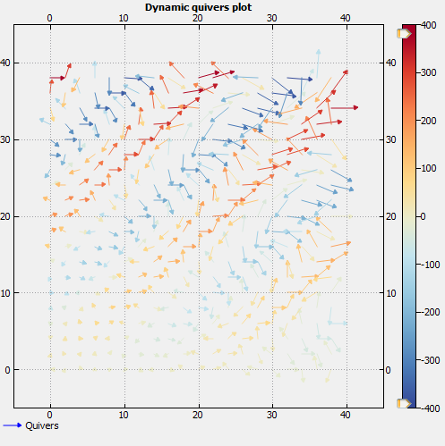

## Scatter

This example shows how to setup a scatter plot and the different scatter plot styles. [Source code](../src/Tests/Plotting/Scatter/main.cpp).
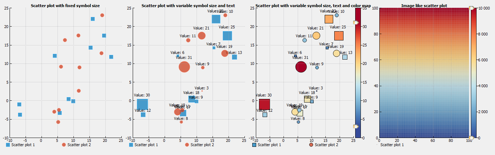

## SceneModel

This example shows how to plot scene models (type VipSceneModel). The left panel displays a live scene model based on polygon interpolation.
The right panel displays a "static" scene model which can be modified (move/resize/rotate shapes) with the mouse. [Source code](../src/Tests/Plotting/SceneModel/main.cpp).

## StreamingCurvePipeline

This example shows how to perform curve streaming with the use of the Agent library provided in the [Core](core.md) library. [Source code](../src/Tests/Gui/StreamingCurvePipeline/main.cpp).
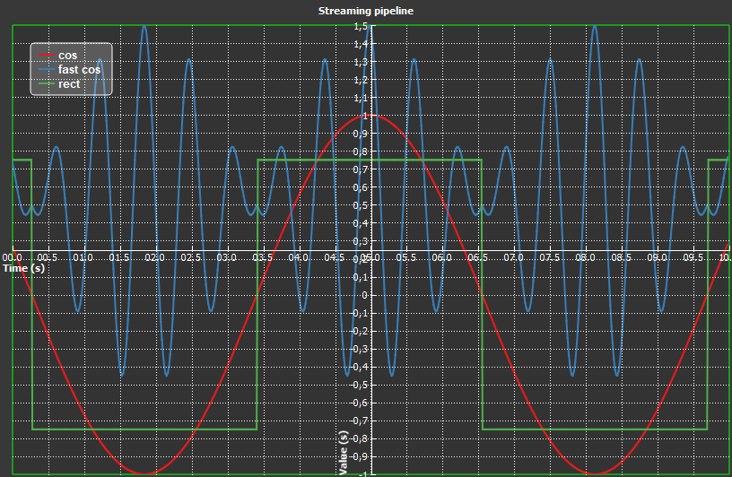

## StreamingMandelbrot

This example demonstrates how to perform heavy streaming of several signals:

-	6 videos displaying a Mandelbrot set
-	1 histogram over a rectangle Region Of Interset (ROI) inside the top left image. The histogram is dynamic: moving the ROI will update the histogram.
-	1 curve displaying the pixel values along a polyline drawn inside the top left image. Like the histogram, the polyline is dynamic.
-	1 curve displaying the time trace of the maximum pixel value inside the ROI.

There are 2 versions of this example: on relying only on the *Plotting* library ([Source code](../src/Tests/Plotting/StreamingMandelbrot/main.cpp)), and one using the **Agent** system from the [Core](core.md) library ([Source code](../src/Tests/Gui/StreamingMandelbrotPipeline/main.cpp)).
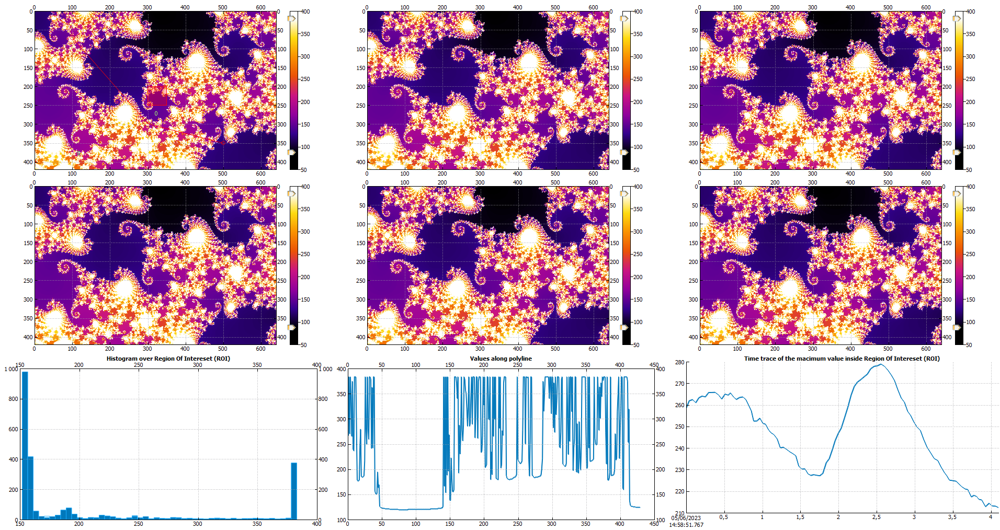

## StyleSheet

This example shows how to use style sheets to customize several types of plots. [Source code](../src/Tests/Plotting/StyleSheet/main.cpp).
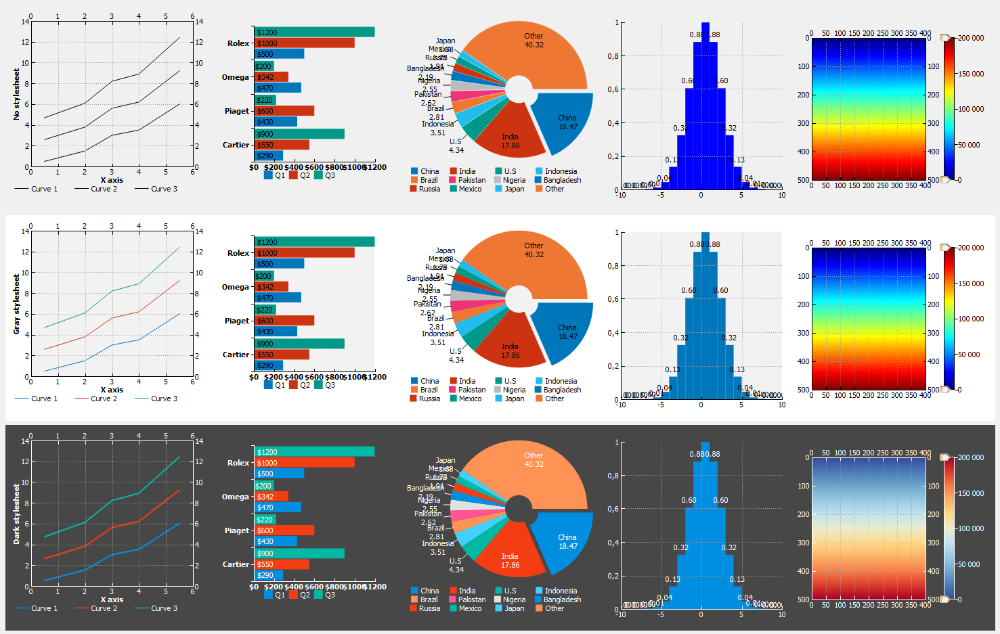

## VStack

This example shows how to vertically stack plotting areas with a shared horizontal axis. [Source code](../src/Tests/Plotting/VStack/main.cpp).
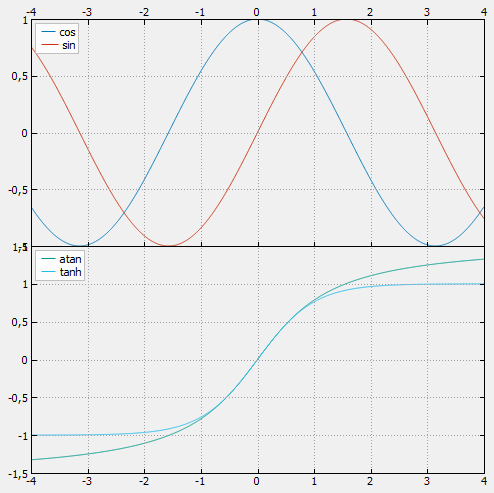

## MultiPlot

This (simple) example shows how to use a QGraphicsLayout to layout plotting areas inside a VipMultiGraphicsView, and how to align axes of several plotting areas. [Source code](../src/Tests/Plotting/MultiPlot/main.cpp).

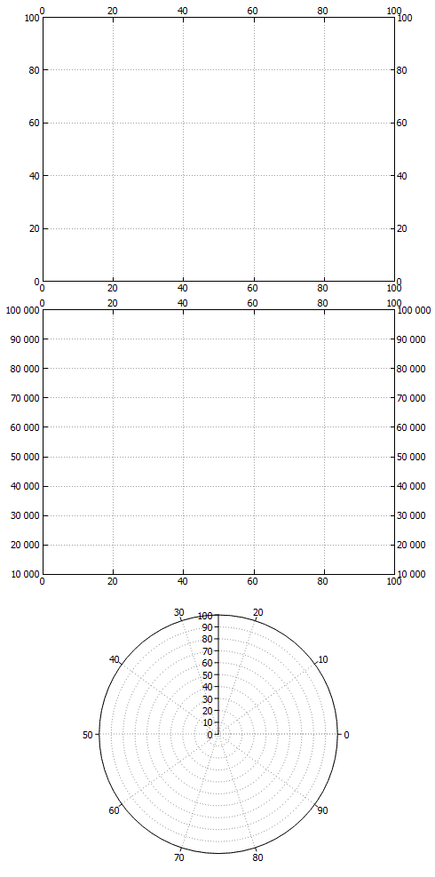
