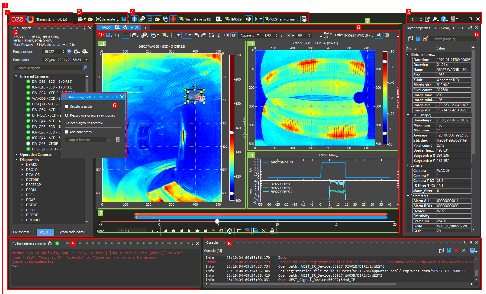

# Gui library

The *Gui* library has 2 purposes:

1.	Makes the bridge between the [Core](core.md) library and the [Plotting](plotting.md) one by defining processing objects (Agent based mechanism, see [Core](core.md) library) suitable to display
any kind of data using the [Plotting](plotting.md) library. See the [StreamingMandelbrotPipeline](../src/Tests/Gui/StreamingMandelbrotPipeline/main.cpp) example for a use case.
2.	Defines most Thermavip application widgets (including the main one) and GUI abstractions.

The *Gui* library could be used within external applications, but mostly for the first usage.

## Extending the Agent library

*Gui* extends the **Agent** system defined in the *Core* library by providing the following processing classes (inheriting `VipProcessingObject`):

-	`VipDisplayObject`: base class for all processing objects used to display... well, anything
-	`VipDisplayPlotItem`: base class for processing objects displaying an input data using a `VipPlotItem` instance from the *Plotting* library
-	`VipDisplayCurve`: a `VipDisplayPlotItem` that displays an input curve using `VipPlotCurve` class
-	`VipDisplayHistogram`: a `VipDisplayPlotItem` that displays an input histogram using `VipPlotHistogram` class
-	`VipDisplayImage`: a `VipDisplayPlotItem` that displays an input image using `VipPlotSpectrogram` class
-	`VipDisplaySceneModel`: a `VipDisplayPlotItem` that displays an input scene model (`VipSceneModel`) using `VipPlotSceneModel` class

See [StreamingMandelbrotPipeline](../src/Tests/Gui/StreamingMandelbrotPipeline/main.cpp) example for a use case.

## Thermavip main interface

The *Gui* library defines most Thermavip application widgets and the main one. Below is a screenshot of Thermavip application interface using WEST dedicated plugins and the dark skin.
Main types of widget are displayed in red or green (for readability).

1.	Main Thermavip widget (class `VipMainWindow`). The main window is accessible using function `vipGetMainWindow()`.
	Note that the *Gui* library will NOT instanciate this window by default, only the first call to `vipGetMainWindow()` will.
	`VipMainWindow` inherits [QMainWindow](https://doc.qt.io/qt-6/qmainwindow.html).
2.	A [QToolBar](https://doc.qt.io/qt-6/qtoolbar.html) displaying the application icon and title, and update progress (if available). Class `VipIconBar`, accessible using `vipGetMainWindow()->iconBar()`.
3.	A QToolBar used to open files, folders, or generate sequential devices. Accessible using `vipGetMainWindow()->fileToolBar()`.
4.	A QToolBar displaying one icon per [QDockWidget](https://doc.qt.io/qt-6/qdockwidget.html) attached to the main window.
	Clicking on an icon will show/hide the related dock widget. Accessible using `vipGetMainWindow()->toolsToolBar()`.
5.	A QToolBar displaying global application settings/help, and close/restore/minimize buttons. Class `VipCloseBar`, accessible using `vipGetMainWindow()->closeBar()`.
6.	Several QDockWidget organized around the main window. They can be shown/hidden using the tools tool bar (4.), stacked (like left ones) or floating.
	Some are provided by the *Gui* library (Console, Recording tools, Player properties) other are provided by plugins (WEST signals, Python internal console).
	The all inherit `VipToolWidget` or `VipToolWidgetPlayer`.
7.	Central part of the main window, class `VipDisplayArea`, accessible with `vipGetMainWindow()->displayArea()`.
	`VipDisplayArea` contains one or more workspaces (class `VipDisplayPlayerArea`) and provides several methods to interact with workspaces.
	A workspace is a widget containing one or more players (videos, images, 2d plots) and an optional playing widget (`VipPlayWidget` class) to start/stop playing and navigate through the time window.
8.	QTabBar (class `VipDisplayTabBar`) allowing to navigate through workspaces, create new workspaces, close workspaces.
	The workspace system itself is basically a QTabWidget (class `VipDisplayTabWidget` accessible with `vipGetMainWindow()->displayArea()->displayTabWidget()`).
	The tab bar is accessible with `vipGetMainWindow()->displayArea()->displayTabWidget()->displayTabBar()`.
9.	Playing widget (class `VipPlayWidget`). Allows to start/stop playing the videos within the workspace, and to navigate through videos time windows.
10.	Workspace widget (class `VipDisplayPlayerArea`). A workspace contains one or more players, a playing widget (9.), and a processing pool (`VipProcessingPool`, see [Core](core.md) documentation) that holds the processing pipeline used to display videos/signals.
	The `VipPlayWidget` interact with the processing pool in order to start/stop playing, go to next/previous/first/last frames, seek through time...
	The workspace organizes its players using a unique `VipMultiDragWidget` (use `VipDisplayPlayerArea::mainDragWidget()`). The `VipMultiDragWidget` organizes players vertically and/or horizontally through QSplitter objects.
	`VipMultiDragWidget` allows to drag and drop basically anything on the players or on its handles (between players), as well as to swap players positions.
11.	Players displaying videos (class `VipVideoPlayer`) and signals (class `VipPlotPlayer`). 
	A player class always inherits `VipAbstractPlayer`. `VipVideoPlayer` displays an image (or spectrogram) using the *Plotting* library. `VipPlotPlayer` displays signals and histograms using the *Plotting* library.

