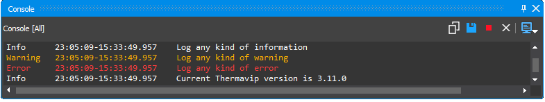

# Logging

The Logging library provides a few helper functions/macros to log information to the console, a file and/or the main Graphical Interface of Thermavip.

Its main components are the ```VipLogging``` singleton class and the ```VIP_LOG_INFO```, ```VIP_LOG_WARNING```, ```VIP_LOG_ERROR``` and ```VIP_LOG_DEBUG``` macros. Usually the ```VipLogging``` class should not be used directly as it is configured by the Thermavip process.
Logging information is not a (too) heavy process as it is equivalent to holding a mutex and pushing a string object to a QList. The actual writting part (to file, console or GUI) is performed by a dedicated thread. Therefore, logging is a thread safe operation that should be used extensively.
Usage example:

```cpp
#include <VipLogging.h>
#include <VipConfig.h>

// ...


// Log an information, a warning and an error
VIP_LOG_INFO("Log any kind of information");
VIP_LOG_WARNING("Log any kind of warning");
VIP_LOG_ERROR("Log any kind of error");

// Log information with multiple arguments
VIP_LOG_INFO("Current Thermavip version is ", VIP_MAJOR_VERSION, "." , VIP_MINOR_VERSION, ".", VIP_MICRO_VERSION);
```

This produces the following output to Thermavip internal console:

