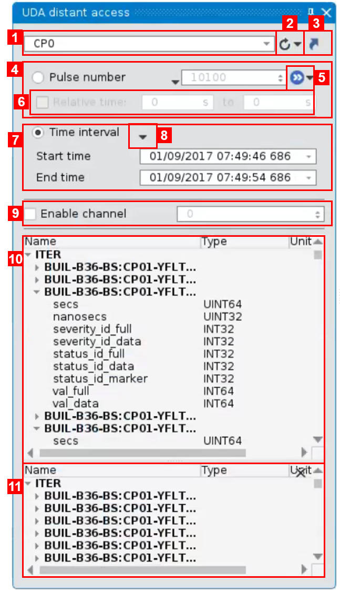
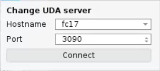
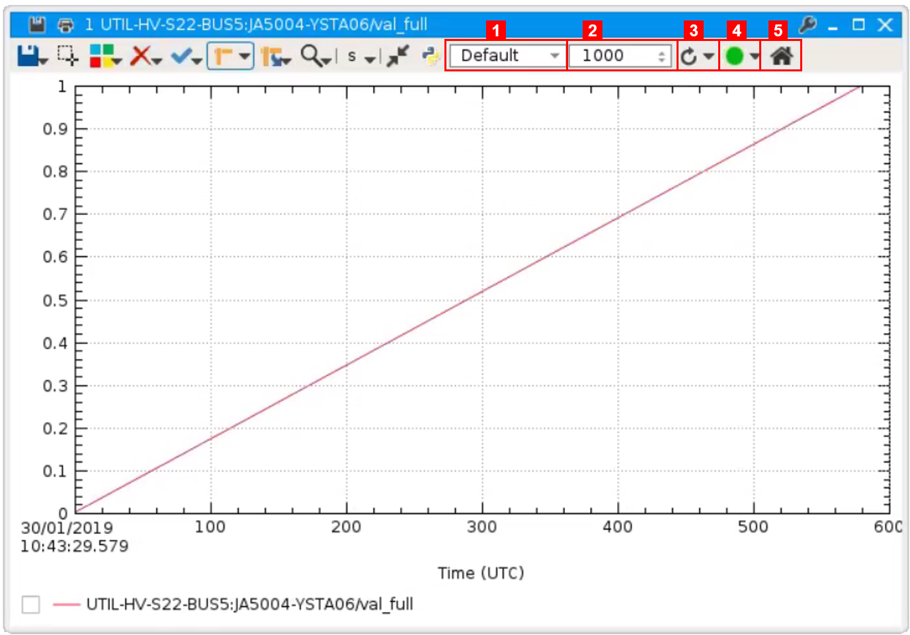

.. _ITER_browse:
 
Browse ITER signals/videos
=========================================================

.. |database_icon| image:: images/icons/database.png
.. |close_icon| image:: images/icons/close.png

Thermavip uses the UDA client to access any UDA server on the network. By default, Thermavip is not connected to any UDA server and you need to specify manually the target server name and listening port (see (2) in the list below). After defining a UDA server, its network parameters will be saved in your session and Thermavip will attempt to establish a connection at starting.

To browse UDA signals, you need to show the :ref:`UDA tool widget <tools>` by clicking on the |database_icon| icon in Thermavip main tool bar (element (3) in :numref:`Fig. %s <main_window>`). 

.. _WEST:  

   
   *UDA signal browser*

This panel displays available UDA videos and 2D signals for a specific UDA server:

1. Search field. Type a (partial) signal name to look for in the current UDA server. The results are displayed in (11).
2. Reload the signal list from UDA server. Clicking the bottom arrow will display a panel to establish a connection to another UDA server:
	

   
   *Connect to UDA server*
   
3. Show the shortcut panel. You can define shortcuts by dragging and dropping any signal from the signal browser (10) to the shortcut panel. The shortcuts are saved within your sesssion.
4. Pulse selection. Signals can be opened either by pulse number or time window. Click on the *Pulse number* button to enable pulse based signal loading.
5. Reload all opened signals within the current workspace for the current pulse number. Click on the bottom arrow to reload signals for the last available pulse number.
6. If *Relative time* is check, you can request a sub part of the signal for given pulse number. The time window is given in seconds relative to the pulse start.
7. Time window selection. Signals can be opened either by pulse number or time window. Click on the *Time interval* button to enable time based signal loading. Note that all time values use the Coordinated Universal Time (UTC). 
8. Click to display a contextual menu with the following options:

	1. *Select last week* : set the time range to the last week 
	2. *Select last day* : set the time range to the last day (24h before the current time)
	3. *Select last hour* : set the time range to the last hour (1h before the current time)
	4. *Select last signal hour* : if only one field is selected in (10), set the time range to the last valid hour of this field.
	5. *Select current player time scale* : if at least on plot player is opened in the workspace, set the time range to the current :ref:`focus <focus_player>` player time scale.
	
9. For signals using a channel number, specify it.
10. List of available signals. This list is updated whenever connecting to a new server or reloading the current one from the (2) button.
   Each signal in the list can be expanded to display its fields and fields units.
   
   To plot a signal field for a given time interval or pulse number, just double click on it. Alternatively, you can drag and drop the field in an existing plot player or in the current workspace area.
   
   You can also open several signals at once: just select several fields and drag/drop them into an existing player or the workspace area (the signals will be plotted in the same player). Alternatively, you can right click on a field and select either *Plot selected signals in the same player* or *Plot selected signals in different players*.
   
   It is possible to plot a signal Y values according another signal Y values. You need to select 2 (and only 2) fields and right click on one of them. From the contextual menu, select wich signal to plot depending on the other.
11. Result of the search (see (1)).
	

2D Signals (1D + time) are opened in :ref:`plot players <players>`. When a plot player displays one or more UDA signal, its tool bar provides additional options as shown on figure below:

   
   *Plotting UDA signals*   
   
1. Select the decimation type. Thermavip displays a decimated version of the signal to decrease the number of samples requested to the UDA server. No matter what is the requested time interval, Thermavip will always display X points, where X is defined in (2). In the figure above, if the raw signal has 10000 points, only 1000 are displayed (1 out of 10). This option let you select one of the following decimation strategy, considering the case where Thermavip displays 1 sample out of 10:

   1. *Default* : take the first simple for each consecutive chunk of 10 samples.
   2. *Max* : take the maximum value for every chunk of 10 samples.
   3. *Min* : take the minimum value for every chunk of 10 samples.
   4. *Average* : take the mean value for every chunk of 10 samples.
   5. *Envelope* : displays the signal envelope (combination of Min and Max).
   
2. Select the decimation value. In this case, the plot player displays 1000 samples no matter the requested time interval.
3. Reload the signal for the current player time scale. Clicking on the bottom arrow let you disable/enable automatic reloading. By default, Thermavip reloads the signal for the current player time scale when performing zooming/panning operations.
4. Start/stop signal streaming. Note that this feature only works for live signals. the streaming is enabled/disabled for ALL signals within the player. Click on the bottom arrow to change the streaming behavior.
5. Home button. Reload all signals for their initial requested time range.