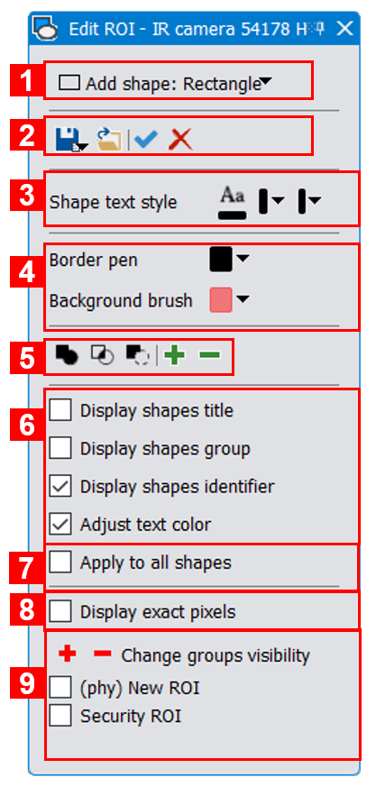
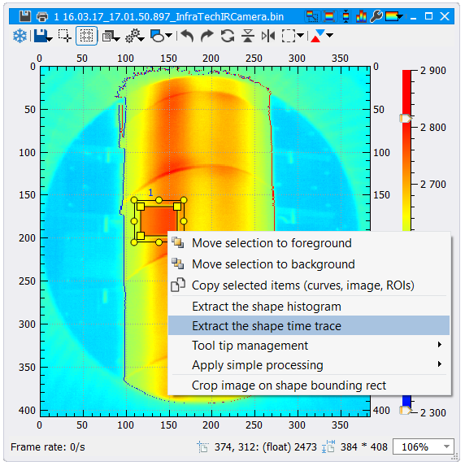
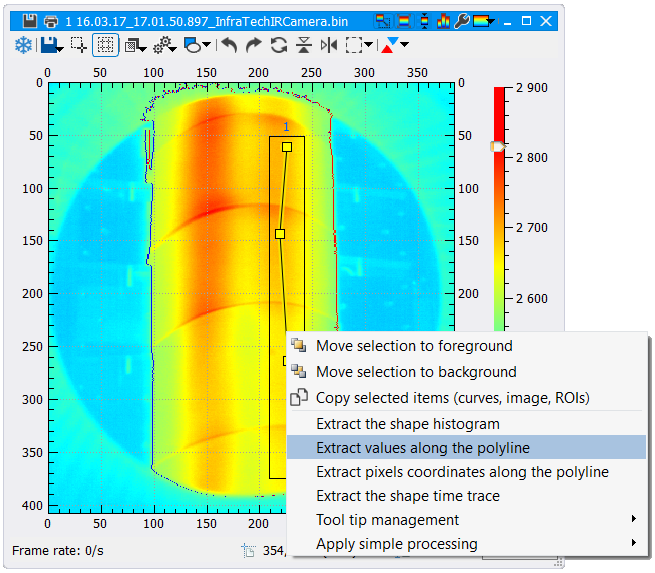

.. _extract:
 
Extracting region statistics inside movies and 2D signals
=========================================================

.. |roi_icon| image:: images/icons/roi.png

You can draw any kind of Regions Of Interset (ROIs) on a video player or a plot player throught the ROI editor :ref:`tool widget <tools>`.
To display the ROI editor, just click on the |roi_icon| icon in the main window tool bar (element (3) in :numref:`Fig. %s <main_window>`).
As a shortcut, each video player provides a |roi_icon| icon in their tool bar to draw ROIs.

.. _roi_tool:  

   
   *Regions Of Interset editor*
   
1. Draw a shape on the current :ref:`focus <focus_player>` player. It could be a rectangle, an ellipse, a polygon, a polyline, a point or a free shape.
2. From left to right: save the ROIs, load a ROI file, select all visible shapes, delete all selected shapes.
3. For all ROIs in the focus player, change the text style. By default, Thermavip draws on top of the shape its identifier (staring to 1). It can also display its group (*ROI*, *Polyline* or *Point*) and its title (if any).
4. For all ROIs in the focus player, change the border pen and background brush.
5. From left to right:

	1. Compute the union shape of selected ROIs in the focus player.
	2. Compute the intersection shape of selected ROIs in the focus player.
	3. Subtract a shape to another.
	4. Add a property to the selected ROIs in the focus player.
	5. Remove a property to the selected ROIs in the focus player.
	
6. Select which information to display on top of the ROIs: shape identifier, shape group and shape title.
7. If this option is checked, the modifications will be applied to all ROIs within the current workspace.
8. If this option is checked, the ROIs will draw exactly the covered pixels.
9. Select which ROIs to show/hide in the focus player.
	
----------------------------------
Extract time traces and histograms
----------------------------------

To extract temporal statistics from a ROI inside a movie (ROI minimum pixel value, maximum, mean,...), you first need to draw the ROI through the ROI editor tool widget.
Then, right click on the ROI. It will display the following menu:

.. _extract_roi:  

   
   *Extract statistical values inside a ROI*
   
From there you can either:

1. Move the ROI to the background/foreground (usefull when multiples ROIs are stacked)
2. Extract the ROI histogram. The histogram is dynamic and will be recomputed when playing the movie.
3. Extract the time traces of the ROI. In this scenario, you will be prompted with the following dialog box:
   
   .. figure:: images/extract_roi_options.png
	  :alt: Extract statistical values inside a ROI
	  :figclass: align-center
	  :align: center
	  :scale: 50%
	  
	  *Time trace options*
   
   1. Only visible if multiple Regions Of Interest are selected. Extract statistics either on the union of selected shapes, on the intersection, or extract the statistics independently for each region.  
   2. You can extract the temporal evolution of: the maximum pixel value, the minimum, the mean, the standard deviation, the number of pixels in the ROI, the entropy, the kurtosis and the skewness.
   3. It is possible to skip images by changing the *Take on frame out of* value.

Extracting statistics inside ROIs is slightly differently for temporal and sequential (streaming) :ref:`devices <playing>`:

1. For temporal devices, the full time traces will be computed directly and displayed in a plot player. After extracting the time traces, moving the ROIs won't update them.
2. For sequential devices, the time traces are displayed in a plot player and will be updated while the streaming goes on. In this case, moving the ROIs will update the next statistics computations.

Extracting statistics inside ROIs will display the resulting curve(s) in a new plot player. Instead of clicking on *Extract the shape time trace*, you can drag and drop it into an existing plot player (the resulting curve(s) will be plotted in this player).

--------------------------------------
Extract pixels values along a polyline
--------------------------------------

To extract a profile, you first need to draw a polyline. Then, right click on the polyline, and select *Extract values along the polyline* from the following menu:

.. _extract_polyline:  

   
   *Extract pixels values along a polyline*
   
The extracted curve is dynamic, and will be updated when playing the movie.

--------------------------------------
Display curves in the same plot player
--------------------------------------

By default, a time trace, histogram or profile will be displayed in a new plot player. However, it is possible to display them in an existing one through `drag & drop <https://en.wikipedia.org/wiki/Drag_and_drop>`_. 
For that, when right clicking on a ROI, select the requested option (*Extract the shape histogram*, *Extract the shape time trace* or *Extract values along the polyline*) and drop it into an existing plot player.
This will add the computed curves into this player.

It is also possible to drag & drop a curve from a player to another.

