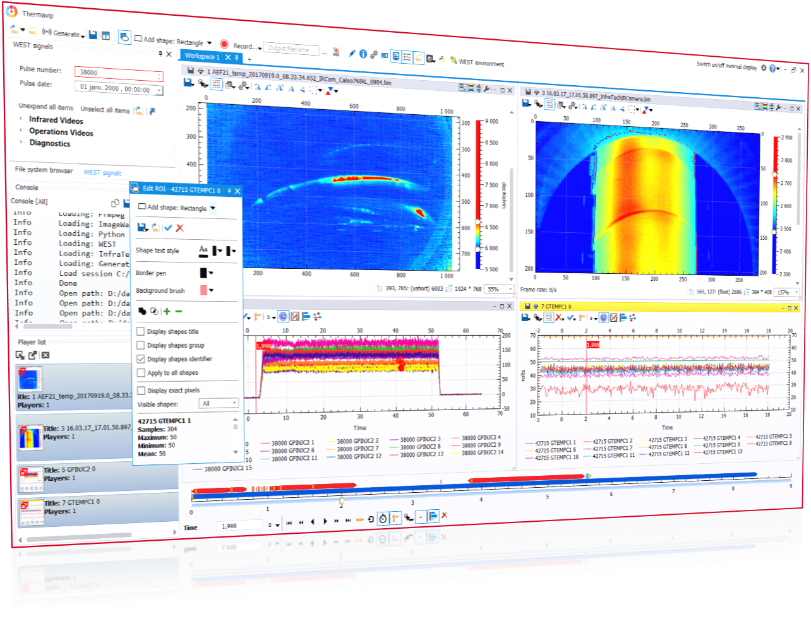
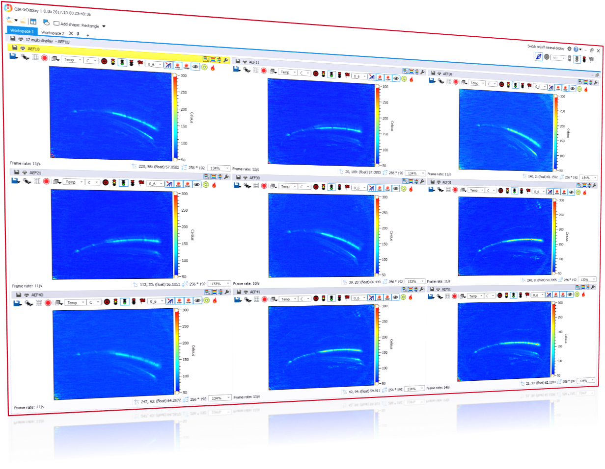

.. Thermavip documentation master file, created by
   sphinx-quickstart on Mon Feb 27 09:55:50 2017.
   You can adapt this file completely to your liking, but it should at least
   contain the root `toctree` directive.
   
.. figure:: images/banner.png
   :alt: Thermadiag
   :figclass: align-center
   :align: center
   :scale: 30%
   :target: http://www.thermadiag.com/index.php/en/
   

Thermavip User Documentation
==================================================

`CEA-IRFM <http://irfm.cea.fr/en/index.php>`_ has gained in-depth expertise at using imaging diagnostics to understand quick-ageing and damaging of materials under high thermal stresses. This knowledge has been used to developp the ThermaVIP (*Viewing Imaging Platform*) software platform, initially designed for the exploitation of infrared thermography diagnostics in fusion tokamaks. This software platform, which required 8 years of development, is made up of a set of modules allowing the exploitation of imaging diagnoses in a complex measuring environments.

Thermavip is a software suite composed of 2 applications sharing the same core features:

1. THERMAVIP - **OFFLINE ANALYSIS**

Thermavip provides a unique and user-friendly graphical interface for visualization and analysis of multi-sensor data. It is directed toward operational supervisors, maintenance supervisors and the staff scientific operating the machine. This version is used for offline analysis based on a sensor database.

   
   *Thermavip - Offline Analysis*
   
2. THERMAVIP - **REAL-TIME ANALYSIS**

Thermavip provides software modules for acquisition, online visualization and archiving of infrared/visible camera videos, as well as other sensor data. This software uses the knowledge of the process experts to build a customized software solution dedicated to the detection of thermal anomalies and defects in materials during real time operations. 

   
   *Thermavip - Real-Time Analysis*

Thermavip is mainly dedicated to operational safety, quality control and comprehension of high-temperature processes in several fields. This documentation describes the software functions for offline analaysis of multi-sensor data in Tokamaks.

For offline diagnostic data analysis, Thermavip provides tools for:

* Data browsing/searching based on a database of signals,
* Synchronization and visualization of heterogeneous sensor data (images, videos, 1D + time signals,...),
* Extracting statistics within videos/signals,
* Applying predefined/custom processings to videos/signals,
* Performing signal fusion processings,
* Recording any kind of sensor/processed data to share with partners.

Thermavip is based on a versatile software architecture composed of a C++ \ **S**\oftware \ **D**\evelopment \ **K**\it (SDK) and a plugin mechanism. Depending on the customer needs, Thermadiag will provide the source code of Thermavip and support for custom components integration.

The SDK itself is based on `Qt <https://www.qt.io>`_ , a powerfull and open source library for generic programming and Graphical User Interface.

Contents:

.. toctree::
   :maxdepth: 2
   
   main
   browse_ITER
   players
   processings
   extract
   saving
   session
   python_ITER
   architecture
   

* :ref:`search`

