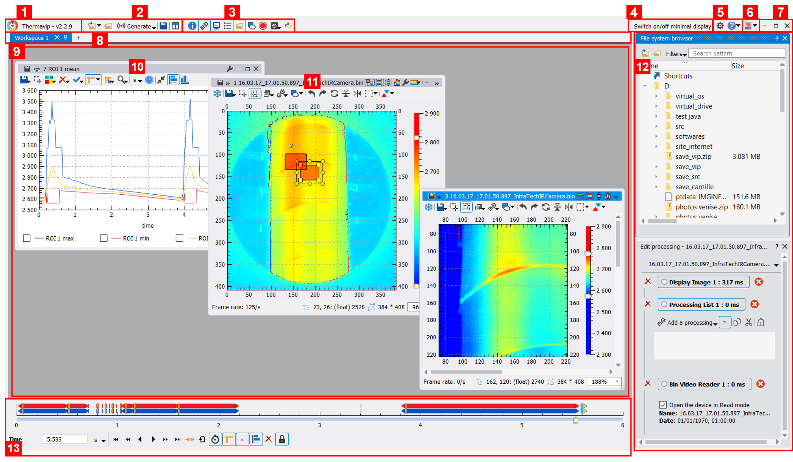
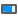
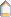
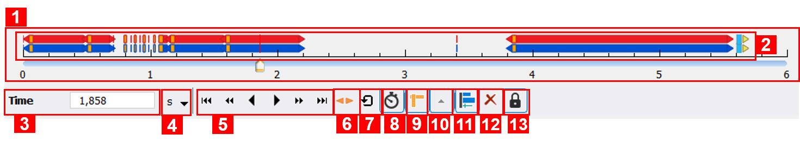

Main interface
==============

The figure below shows the main interface of Thermavip. It displays the following elements:

1. The Thermavip title bar. You can move the main window with the mouse from there if Thermavip is not maximized.
   It displays the current version number and other information depending on the plugin configuration.
   It also displays a |update_icon| icon when an update is available (click to update).
2. Tool bar to :ref:`open <open>` signals/movies/folders, generate signals, save :ref:`sessions <session>` and reorganize opened :ref:`players <players>`.
3. Tool bar to show/hide all Thermavip :ref:`tool widgets <tools>`.
4. Switch on/off minimal display. When switched on, Thermavip will hide all tool widgets and hide other :ref:`players <players>` widgets
   to maximize the visualized signals area.
5. Show the global Thermavip options and show the documentation/about dialog.
6. :ref:`Record <record_interface>` the Thermavip interface as a movie (usually for presentations or demonstrations).
7. Minimize/maximize/close Thermavip.
8. Tab header to navigate throught the workspaces_.
9. Display area containing all players for the current :ref:`workspace <workspaces>`.
10. A typical :ref:`plot player <players>` .
11. A typical :ref:`video player <players>` .
12. 3 different :ref:`tool widgets <tools>` (from top to bottom: opened players, directory browser, output console).
13. The :ref:`playing widget <playing>` used to play movies.

.. _main_window:  

   
   *Main Thermavip window*

   
.. _tools:   

------------------------------------
Tool bars and tool widgets
------------------------------------

Thermavip offers many tools to interact with video/signal players (draw Regions Of Interest, record signals,...). 
These tools are usually widgets that can be shown/hidden through the dedicated tool bar (3).
Tool widgets can be displayed on top of the main interface, or docked on the sides of the main window (like (12) ).
When closing Thermavip, your tool widgets organization (shown/hidden/docked) will be saved and reloaded when reopening.

.. |edit_icon| image:: images/icons/edit.png

.. |roi_icon| image:: images/icons/roi.png
.. |record_icon_icon| image:: images/icons/record_icon.png
.. |processing_icon| image:: images/icons/processing.png

.. |list_icon| image:: images/icons/list.png
.. |open_dir_icon| image:: images/icons/open_dir.png
.. |console_icon| image:: images/icons/console.png
.. |python_icon| image:: images/icons/python.png

By default, Thermavip provides the following tools:
 
1. |infos_icon| Display the attributes of selected image, curve, etc. For instance, videos usually have several attributes: a name, a date, an author, and possibly temporal attributes like, for instance, the sensor temperature (for IR cameras),... See this :ref:`section <player_information>` for more details.
2. |roi_icon| Edit Regions Of Interest (ROIs) and display statistics inside ROIs. See this :ref:`section <extract>` for more details.
3. |record_icon_icon| Record videos and signals. See this :ref:`section <saving>` for more details.
4. |processing_icon| Add/Remove/Edit processings for movies and 2D signals. See this :ref:`section <processings>` for more details.
5. |python_icon| Show the embedded Python interpreter.
6. |console_icon| Display/hide the output console. This console displays general information on the current operation as well as errors and warnings.
   The figure below shows the console tool widget. It displays:
	
	1. A tool bar for: copying the content to the clipboard, saving the content to a file, stop the console, clear the console, select which information to display.
	2. The console's content with, for each entry, its level (info, warning or error), its date and text.
	   
	.. figure:: images/console.png 
	   :alt: Thermavip console
	   :figclass: align-center
	   :align: center
	   :scale: 50%
	   
	   *Thermavip console*
	   
7. |list_icon| Display all opened players in the current workspace. From this tool widget, you can easely show/hide/minimize/maximize/close players.
   The figure below shows the players tool widget. It displays:
	
	1. A tool bar for: minimizing all players, restoring all minimized players, closing all players.
	2. A list of all available players with a miniature representation, the player's title and a few other attributes. You can right click on an item to display a contextual menu with additional options.
    
	.. figure:: images/list_players.png 
	   :alt: List of available players
	   :figclass: align-center
	   :align: center
	   :scale: 50%
	   
	   *List of available players*
		   
8. |open_dir_icon| A directory browser. It provides tools to browse your file system and open signals. 
   The figure below shows the directory browser tool widget. It provides the following features:
	
	1. Open selected files. You can also open the files with a double click.
	2. Open selected directories.
	3. Select a filter among the file types supported by Thermavip.
	4. Search a file on selected folder (incomplete file names are supported with the use of '*').
	5. Your file system.
	6. Results of the search (hidden by default).
	7. Shortcuts. This is a virtual directory where you can drop files/directories to access them later in a faster way.
	   The shortcuts are saved in your session when closing Thermavip.
	
	.. figure:: images/browser.png 
		   :alt: Directory browser
		   :figclass: align-center
		   :align: center
		   :scale: 50%
		   
		   *Directory browser*

Thermavip plugins may add additional tool widgets.

.. _workspaces: 
 
------------------------------------
Players area and workspaces
------------------------------------

In Thermavip, all players are organized in workspaces. A workspace is basically an area where the players live, can be moved, minimized/maximized and closed (number 9 in :numref:`Fig. %s <main_window>`). 
You can have as many workspaces as you want in Thermavip, close them and switch from one to another using the dedicated tab bar (number 8 in :numref:`Fig. %s <main_window>`).
To create a new workspace, just click on the '+' button on the dedicated tab bar. 

.. _open:   

------------------------------------
Opening signals and movies
------------------------------------

.. |open_file_icon| image:: images/icons/open_file.png

To open a signal from a file, just click on the |open_file_icon| icon in the dedicated tool bar (number 2 in :numref:`Fig. %s <main_window>`), or use the 
directory browser tool widget.

You can also open a full directory through the |open_dir_icon|. In this scenario, Thermavip can either:

1. Open all files in the directory (recursively or not) and interpret them as separate signals (the default).
2. Open all files in the directory (recursively or not) and interpret them as several frames of the same temporal sequence. For instance, if you open a directory containing a sequence of images, Thermavip will interpret it as a single video with as many images as the folder's content.

Additional plugins may provide new tool widgets to open signals from a local/distant database.
Signals opened through the ways described above will be displayed in :ref:`players <players>` (video player or plot player) within the current workspace.

.. _playing:  

------------------------------------
Playing movies
------------------------------------

.. |resize_times_icon| image:: images/icons/resize_times.png
.. |slider_limit_icon| image:: images/icons/slider_limit.png

Thermavip sorts the signals in 3 categories:

1. Resources. A resource signal is a single self consistent data that has no notion of time. This might be for instance a single image or a CAD file.
2. Sequencial devices. A sequential device is a temporal signal with no notion of start or end time, and no possibility to request a specific time within the signal. This is the case when streaming a video from a camera.
3. Temporal devices. A temporal device has a start and end time and you can freely walk through all possible timestamps. This is usually the case for video files.

When opening a temporal device in the current workspace, Thermavip will display a playing widget to walk through the signal (for instance a video), as shown on :numref:`Fig. %s <playing_widget>`:

.. _playing_widget: 

		   
		   *Playing widget*

1. Time scale. There is only one playing widget per workspace, therefore all players within a workspace are automatically synchronized and the time scale displays the intersected temporal limits of all players. You can seek through the movies/signals with the |time_slider_icon| time slider.
   The time scale also displays the time ranges of each player (2).
2. Players time ranges. This area displays the time ranges of each individual player with a different color. Through the |move_times_icon| icon, you can translate a time range in order to synchronize movies.
   You can also use the |resize_times_icon| icon to resize a video time range. To revert back the time ranges of all videos within the workspace, use the (12) button.
3. Current time. The time unit is displayed on (4).
4. Time unit. In Thermavip, all timestamps are given either in relative nanoseconds, or in absolute nanoseconds elapsed since Epoch (absolute date time). However, it might be more convinient to display the time scale in seconds for longer movies.
   This button allows to change the time unit of the time scale.
5. Playing buttons. From left to right: first time, previous time, play backward, play forward, next time, last time.
6. Time window. Checking this icon will display 2 |slider_limit_icon| icons on the time scale, used to select a sub time window. Video playing as well as most of Thermavip temporal features (extract temporal statistics in ROIs, saving movies,...) will be bounded by this time window. 
   Uncheck the button to disable this feature.
7. Repeat playing.
8. Select a playing speed.
9. Automatically recompute the time scale limits. This is usefull for instance if you used the mouse wheel to zoom on the time scale.
10. Show/hide the players time ranges (2).
11. Make all time ranges start to 0. This is usefull to synchronize movies having completely different start times. For instance, one movie has a relative start time of 0 (most of them), and another one has an absolute start time expressed in nanoseconds since Epoch.
   In this scenario, the time scale will stretch from 0 to a huge number (something like 1.4*10e18 nanoseconds!), you wont event be able to see the time ranges anymore. 
   Using this option will slide the second movie in order to start to 0, making possible to synchronize the 2 videos.
   To revert back the time ranges of all videos within the workspace, use the (12) button.
12. Revert back the time ranges of all videos within the workspace.
13. Unlock time ranges. By default, time ranges (2) are locked and cannot be moved with the mouse for movie resynchronization. You need to uncheck this option before.

.. _record_interface:  

------------------------------------
Recording the Thermavip interface
------------------------------------

.. |record_icon| image:: images/icons/record.png

It is possible to record the Thermavip interface in a movie while you are performing your analyses.
This is for instance usefull for demonstrations in a PowerPoint presentation.
For that, click on the right arrow of the |record_icon| icon. This will display a dialog box to edit:

1. The recorded movie frame rate (in KB/s),
2. The acquisition rate (in images/s),
3. The recorded movie FPS (used when replaying the movie),
4. The recorded video width and height (by default the Thermavip dimensions),
5. The record output video file.

It is also possible to start/stop the recording when playing/stop playing the movies.
In addition, you can choose to record only one player instead of the whole Thermavip interface.

