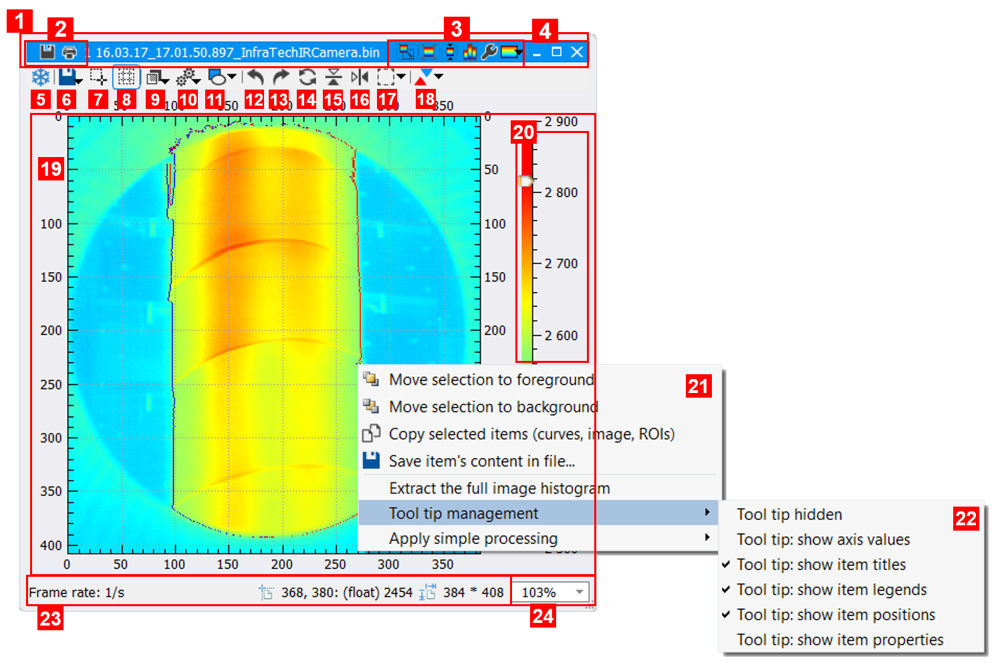
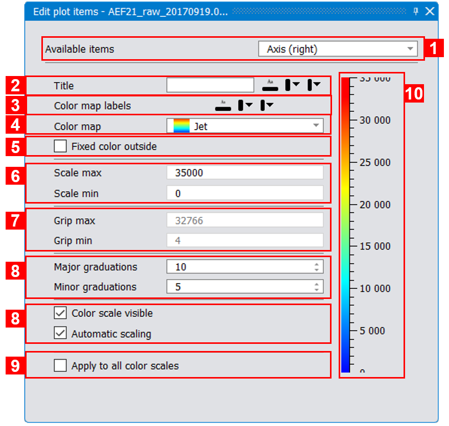
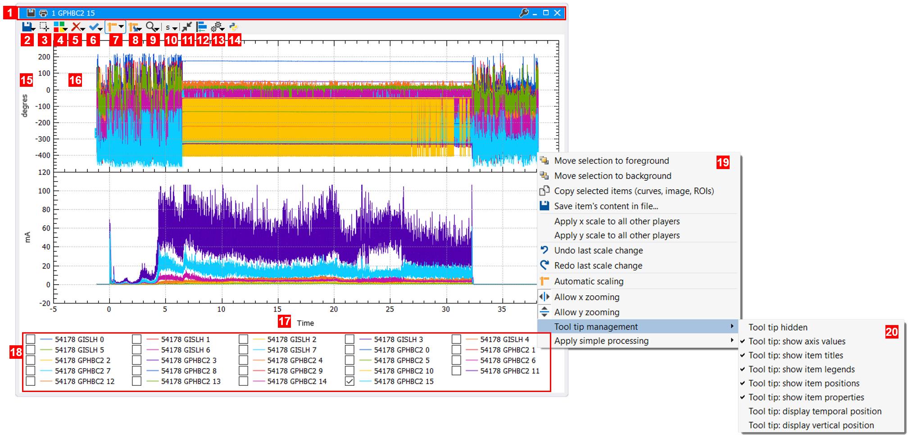
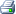
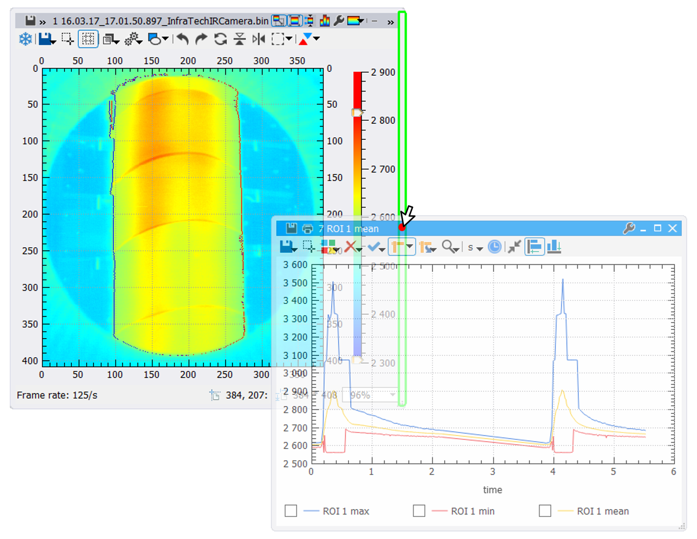
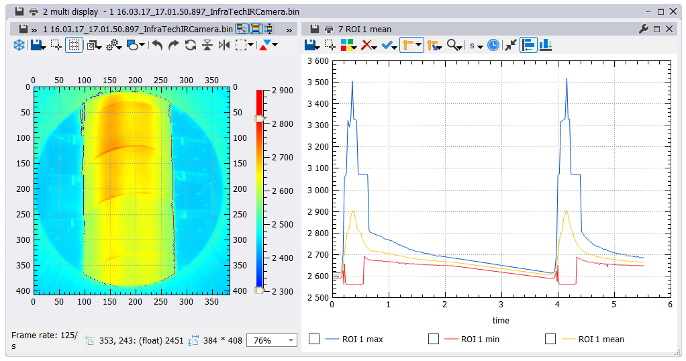

.. _players: 

Visualizing movies and 2D signals
=================================

Videos and any other kind of signals are displayed in players, within a :ref:`workspace <workspaces>`.
To open and display a signal, see this :ref:`section <open>`. To play a video or any other kind of temporal signal, see this :ref:`section <playing>`.

.. _focus_player: 

------------------------------------
Focus player
------------------------------------

The :numref:`Fig. %s <video_player>` displays a typical video player with a blue title bar. This color means that this player has the focus in its workspace.
In a workspace, only one player can have the focus at a time. The focus player displays a blue title bar while the other ones display a gray one.
The focus is an important concept since several :ref:`tool widgets <tools>` use it (like the :ref:`Regions Of Interset <extract>` one).

------------------------------------
Video players
------------------------------------

.. |color_map_icon| image:: images/icons/tools.png

.. |scaletools_icon| image:: images/icons/scaletools.png

The figure below shows a video player within Thermavip.

.. _video_player:  

   
   *Example of video player*
   
1. (Title bar) The player's title bar. You can move a player with the mouse through this title bar (exactly like the Windows desktop).
2. (Title bar) Save or print a screenshot of the video player. This will hide all buttons/icons/tool bars in order to only keep the image and color map.
3. (Title bar) Buttons to control the color map (20). From left to right: show/hide the color map, enable/disable automatic color map, adjust min/max to grips, histogram equalization (for better image rendering), display full color map options, change the color map.
4. (Title bar) Minimize, maximize or close the player.
5. Freeze player. By default, all video players within the same workspace are synchronized. However, you might need to "freeze" a player in order to avoid its update when playing/moving the time slider.
6. Save the raw players's image in a file.
7. Select items in area. Check this option to select all shapes/Regions Of Interests with a rectangle drawn with the mouse. This is usefull when you defined a lot of regions and want to suppress/move several of them.
8. Show/hide the surrounding axes. 
9. Superimpose an image. You can superimpose the current image of any video within the same workspace. A slider let you modify the superimposition opacity.
10. Apply a processing to the movie. See this :ref:`section <processings>` for more details.
11. Draw a Region Of Interest (or Shape). By default, clicking on this button let you draw a rectangular region onto the image. Click on the right arrow to select a different shape (ellipse, free region, polygon, polyline or points).
12. Anticlockwise rotation of 90 degrees.
13. Clockwise rotation of 90 degrees.
14. Rotation of 180 degrees.
15. Vertical reflection.
16. Horizontal reflection.
17. Manual cropping (draw the crop area with the mouse).
18. Display/Hide the local minimums/maximums within each region (or the whole image if no regions are defined).
19. The image itself.
20. The Color map, used to transform numeric values to RGB colors. The color map is only displayed when dealing with numeric pixels. By default, the color map is automatic and expand to the minimum and maximum pixels of the image. You can adjust the minimum/maximum of the color map using the 2 sliders. To display advanced options, double click on the color map or press the |scaletools_icon| icon in the title bar. This will prompt the dialog box on :numref:`Fig. %s <colormap_options>`.
21. Contextual menu displayed when right clicking on the image. From top to bottom:
		1. Move selected items (image, ROIs) to the foreground.
		2. Move selected items (image, ROIs) to the background.
		3. Copy selected items (image, ROIs). The items can be pasted in another player or in the display area of a workspace (area containing all players).
		4. Save the current image in file.
		5. Extract the full image histogram (it will be displayed in a new plot player).
		6. Tool tip management. The tool tip is the text displayed over the image when hovering with the mouse. This sub-menu allow you to customize the kind of information displayed in this tool tip. Any change will be applied to all video players.
		7. Apply a processing to the video.
		
23. General information on the video: frame rate (while playing), mouse position (in pixels), image size.
24. Current zoom. You can change the zoom value from there or reset it by selecting 'Expand'.

The figure below displays the advanced color map options.

.. _colormap_options:  

   
   *Color map options*
   
1. Select a plot item to edit in the video player (axes, canvas, image, color map,...). The color map panel is basicaly the :ref:`tool widget <tools>` used to edit plot items.
   You don't need to use this option to edit the color map.
2. Color map title, displayed vertically on the right of the color map. You can also change the text color, font and background color.
3. Color map labels options. You can change the labels color, font and background color.
4. Type of color palette used to map numeric pixel values to RGB colors. The default color palette is the *Jet* one.
5. Fixed color outside the color map bounds. Remember that you can change the color map bounds using the 2 |color_map_slider_icon| icons. By default, all pixel values outside these bounds will be colored with the closest color (for *Jet* palette, blue and red respectively).
   If checking this option, all pixel values outside the color map bounds will have a fixed color. This color can be changed by clicking on the corresponding icon.
6. Minimum and maximum values of the color map scale.
7. Minimum and maximum values of the color map bounds, represented by the |color_map_slider_icon| icons.
8. Number of major and minor graduations for the scale.
9. If you check this option, all modifications applied on the color map through this tool widget will be applied to all video players within the same workspace.

------------------------------------
Plot players
------------------------------------

Plot players are used to represent 2D data except images: curves, histograms,... The figure below shows a typical plot player within Thermavip:

.. _plot_player:  

   
   *Example of plot player*
   
1. Title bar with the same options as the video player.
2. Save a curve to a file. Several file format are supported, including text (ascii) files and CSV ones. It is possible to save all signals in the same file.
   In this case, the file will contain one column for the X (time) values and one row for each signal. 
   Note that all signals will be resampled in order to share the same X values. 
   Only the CSV format stores the curve units.
3. Zoom on an area defined with the mouse. Uncheck to stop area zooming.
4. Show/hide the legend and the grid.
5. Suppress curves. You can also suppress curves by selecting them (left click on the curve) and press SUPPR key.
6. Show/hide curves. Hidden curves are ignored for automatic scaling.
7. Automatic scaling. Check this icon to enable the automatic scaling (X and Y scale boundaries are automatically computed based on the visible curves).
   Click on the right arrow to display more options (undo/redo last scale changes, and autoscale only for X or Y axis).
8. Apply scales to all. This will prompt you with a menu containing 2 options:
	* "Apply X scale to all": apply this player X (time) scale to all other players within the current workspace.
	* "Apply Y scale to all": apply this player Y scale to all other players within the current workspace. Note that only Y scales having the same unit are concerned.
9. Enable/disable X/Y zooming. This concerns :ref:`zooming with the wheel <zooming>`, area zooming (3) and :ref:`mouse panning <zooming>`.
10. If the abscissa is a time unit (expressed in nanosecons), this option let you choose the displayed time unit (seconds, milli seconds, micro seconds or nano seconds).
11. Normalize all curves between 0 and 1. This is usefull if the player displays multiple curves with completely different ranges.
12. Make all curves start to 0. This is usefull if the player displays multiple curves with completely different starting X (time) values.
13. Apply a simple processing to selected curves. See the :ref:`processing <processings>` section for more details.
14. Apply a Python processing based on multiple curves. See the :ref:`processing <processings>` section for more details.
15. Y axes. The plot player uses multiple stacked Y axes when displaying curves with different Y units.
16. The plotting area. Use the mouse wheel to zoom on a specific area. Use the right mouse to move around the area.
17. The X axis, usually representing a time value in nanoseconds.
18. The legend. You can check items to select them. 
19. Contextual menu when right clicking on the plotting area (16). The menu displays several options also accessible from the player tool bar.
20. Customize the content displayed in the tool tip (text displayed when hovering the curves with the mouse): 
		* "Tool tip hidden": no tool tip is displayed.
		* "Tool tip: show axis values": display the exact X and Y(s) values behind the mouse.
		* "Tool tip: show item titles": display the titles of the curves closed to the mouse.
		* "Tool tip: show item legends": display the legend of the curves closed to the mouse.
		* "Tool tip: show item position": display the closest point coordinates.
		* "Tool tip: show item properties": display the closest curves properties (if any).
		* "Tool tip: display temporal position": display a vertical marker behind the mouse. The tool tip will contain information for the closest point of ALL curves.
		  The vertical marker position is reflected in the other plot players within the workspace. Uncheck this option to go back to previous tool tip.
		* "Tool tip: display vertical position": same as previous, but displays a horizontal marker instead.

Video and Plot players are the standard player types within Thermavip. Additional plugins can add other types; for instance, the *Tokida* plugin add a player to display 3D CAD data.

.. _zooming: 

------------------------------------
Zooming in players
------------------------------------

For video players, you can zoom/unzoom either with the mouse wheel or the combo box displayed at the bottom right of the video player.
When zooming with the wheel, the zoom will be centered on the pixel behind the mouse. After a zoom operation, you can navigate through the image 
with the vertical/horizontal silders appearing around the video, or you can use the mouse panning (right click, hold the button and move around).

Zooming in plot players is pretty much the same, except that you have more control by enabling/disabling X and Y zooming.

------------------------------------
Selecting items
------------------------------------

You can select items (curves, histograms, Regions Of Interest) within a player by simply clicking on them. To select multiple items, use the CTRL key modifier.
Selecting items is used for several purposes:

* Move or suppress Regions of Interest in video/plot players (press SUPPR key to delete selected regions).
* Supress curves/histograms in plot players (press SUPPR key).
* Apply a simple processing on curves (button 13 of the plot player). The processing is applied to all selected curves.
* Apply a data fusion processing to multiple curves. See the :ref:`processing <processings>` section for more details.
* Copy ROIs/image/curves/histograms. For that, right click on the selected items and select "Copy selected items". Then, in another player (or in Display area of a workspace), right click and select "Paste items" to copy back selected items. Note that you cannot copy an image to another player.
* Display curve properties. The :ref:`player information <player_information>` tool widget displays the information of the last selected item in the :ref:`focus <focus_player>` player.

.. _player_information: 

------------------------------------
Player information
------------------------------------

.. |infos_icon| image:: images/icons/infos.png

The Player Information :ref:`tool widget <tools>` displays information on the current :ref:`focus player <focus_player>`. To show this panel, click on the |infos_icon| icon
from thermavip top tool bar.

For video players, it displays:
* Video properties (image size, video duration, pixel unit,...).
* The statistics inside the current image (min, max, mean, standard deviation).
* The statistics inside the selected Regions Of Interest (if any).

For plot players, it displays the properties of the selected curve. If multiple curves are selected, the last selected one is chosen. If no curve is selected the first one 
in the legend it chosen. The properties are the following:
* Global curve properties (name, units,...)
* Curve statistics (min, max, mean, std. deviation ox Y values, min and max of X values). The statistics are computed for the part of the curve within the current X scale, not the full curve.

The :numref:`Fig. %s <player_info>`. shows an example of player information on a plot player.

.. _player_info:  

.. figure:: images/player_properties.png
   :alt: Player information panel
   :figclass: align-center
   :align: center
   :scale: 80%
   
   *Player information panel*

------------------------------------
Moving players and multi-players
------------------------------------

.. |save_file_icon| image:: images/icons/save_as.png

.. |save_toolbar_icon| image:: images/icons/save_toolbar.png
.. |print_toolbar_icon| image:: images/icons/print_toolbar.png

Players can be moved through their title bar, exactly like any window on your computer desktop. Likewise, they can be minimized, maximized or closed.
It is also possible to resize players with their size grip (bottom left corner) and through their borders.

When moving around a player, you will notice a green area appearing when hovering above another player's border, as shown on :numref:`Fig. %s <merge_players>`. If you drop your player there, the 2 players will be gathered into a multi-player (:numref:`Fig. %s <multi_player>`).

.. _merge_players:  

   
   *Drop a player into another one's border to create a multi-player*
   
Like a standard player, a multi-player has a title bar and can be moved around and drop on another player's border. You can combine together as many players/multi-players as you want.
To remove a player from a multi-player, just move it through its title bar.

.. _multi_player:  

   
   *An example of multi-player*

This functionality has 3 goals:

1. It is easier to organize a workspace by gathering related players into multi-players.
2. You can save or print a screenshot of a whole multi-player with the |save_toolbar_icon| and |print_toolbar_icon| icons.
3. You can create a video of a multi-player's content with the :ref:`Record tool widget <generate_video>`.

------------------------------------
Unique identifier
------------------------------------

In Thermavip, each player has a unique identifier (number starting to 1). This identifier is visible in the title bar: the title **always** starts with the identifier number.

This identifier is used in a few tools of Thermavip to find a player based on its title. Indeed, several players might have the same title and this identifier is the only way to discriminate them.
