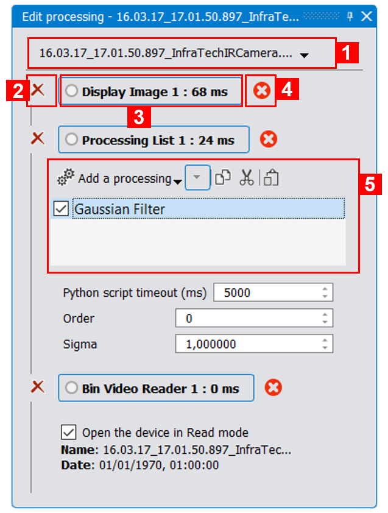
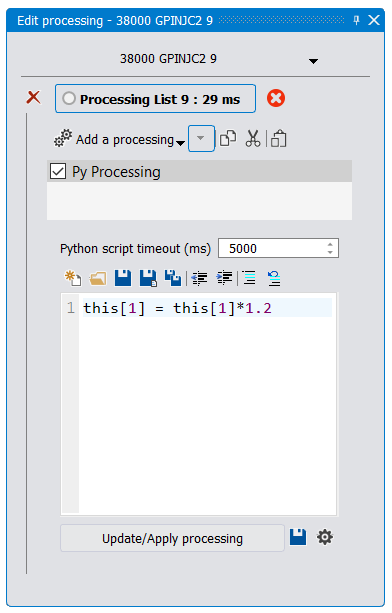
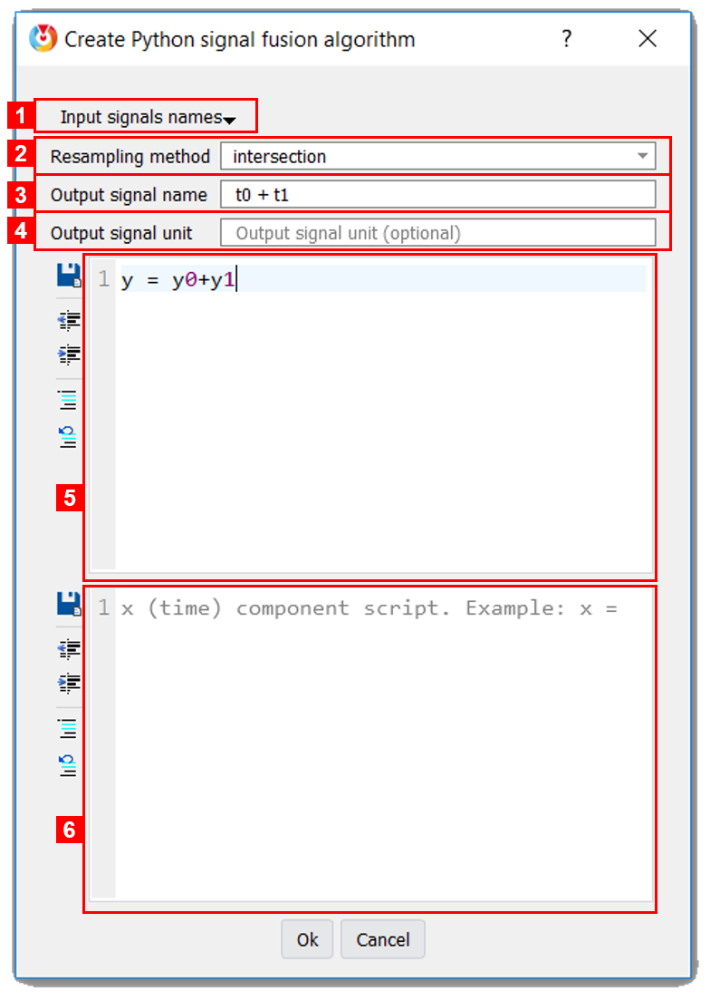

.. _processings: 

Applying processings to movies and 2D signals
=============================================

Thermavip provides an elegant architecture to define and manipulate processings. All processings define any number of inputs, outputs and properties. Each output of a processing can be connected to an input/property of any other processing.
All processings are asynchronous, meaning that they all live in different threads and can be applied in parallel. A processing is simply triggered when a new input is available.
In theory, this let you build very complex asynchronous workflows, like shown on :numref:`Fig. %s <workflow>`. 

.. _workflow:  

.. figure:: images/workflow.png
   :alt: Complex processing workflow
   :figclass: align-center
   :align: center
   :scale: 50%
   
   *Complex processing workflow*
   

In practice, Thermavip does not currently provide a graphical way to edit such workflow.
It is however very simple to apply a processing to a video or a curve through the players tool bar.

In Thermavip, almost everything is a processing. Reading the images from a video is made by a specific processing. Displaying the image content on video player is a processing.
Applying a rotation to an image is, obviously, a processing. Recording a signal to a file is a processing.

--------------------------------------------------------------------------------
Apply a simple processing on a video or a curve
--------------------------------------------------------------------------------

.. |processing_icon| image:: images/icons/processing.png

When opening a movie or signal, Thermavip internally create the following processing workflow:

.. _video_workflow:  

.. figure:: images/video_workflow.png
   :alt: Video processing workflow
   :figclass: align-center
   :align: center
   :scale: 50%
   
   *Standard video/signal processing workflow*

The *Video file loader* (in charge of reading images from the video file) is connected to a processing list, which is itself connected to a video display (the video player).
A processing list is basically a container where you can stack as many processings as you want. Of course a processing list can only contain very simple processings having one input and one output.

To apply an *image processing* / *computer vision algorithm* on a video, click on the |processing_icon| icon in the video player tool bar (see :numref:`Fig. %s <video_player>`). This will display a list containing all available video processings sorted by categories.
Just click on a processing to add it to the processing list (as seen on the workflow :numref:`Fig. %s <video_workflow>`). That's it, the processing is now applied to the video.

Applying a processing to a curve is very similar. You first need to select the curve you want to process (just click on it), then click on the |processing_icon| icon in the player tool bar, and select the processing.

Note that applying a video/signal processing this way will modify the current image/curve inplace. You might also want to create a new video/curve with the result of the processing.
For that, instead of clicking on the processing you want, you can drag and drop it in a player (for curves) or in the workspace to create a new player.

When you apply a new processing, the :ref:`processing editor <processing_editor>` will be automatically displayed.

.. _processing_editor: 

----------------------------------------
Edit a processing
----------------------------------------

.. |reset_icon| image:: images/icons/reset.png

As you will see, adding a processing as described above will automatically display the processing :ref:`tool widget <tools>` (:numref:`Fig. %s <processing_tool>`). You can also display it through the dedicated |processing_icon| icon in the main window tool bar (element (3) in :numref:`Fig. %s <main_window>`).
This tool widget displays the options for all processings in the workflow (for instance from the file loader to the video display).

.. _processing_tool:  

   
   *Processing editor*

1. List of available display processings within the current workspace. From there, you can select a video or a curve and see the workflow leading to this item.
   Another way to see the wrokflow of a plot item is to click on it (for instance, just click on a curve to see the workflow leading to this curve).
   In this example, we selected a video and we see that 3 processings are involved in the video display: the video file loader (a *BinVideoReader* object), a processing list and the video display itself.   
2. Click on the |reset_icon| icon to reset the corresponding processing. This is mainly usefull for temporal algorithms (like computer vision ones) that need to be initialized on the current image. For most processing, this will only reapply it (and therefore apply the next processings in the workflow).
3. The processing name. You can click on this button to show/hide its options. It also displays the last computation time for the processing in milli seconds.
4. Show/hide the last errors (if any) for this processing.
5. The content of the processing list. In this example, there is already one processing in the stack (a gaussian filter).
   You can select and suppress several processings within the list (with SUPPR key), or just disable them with their checkboxes.
   Select a processing to display its options in an editor.

   
----------------------------------------
Apply a signal fusion processing
----------------------------------------   

It is possible to apply a processing that takes several curves as input and create a new curve as output.
Within a plot player, select the curves you want as input of the processing. If more than one curve are selected, the |processing_merge| button will be visible in the player tool bar.
Click and select the processing to be applied. The result will be displayed in a new curve within this player.

It is also possible to drag & drop the processing to display the resulting curve in another or new player.

--------------------------------------------------------------------------------
Apply a simple custom processing on a video or a curve
--------------------------------------------------------------------------------

If you have the Python plugin, it is possible to apply a custom Python processing to a video or a curve.
For that select the *Miscellaneous/Py Processing* processing with the |processing_icon| icon.

This will open the processing editor from which you can edit the Python script (:numref:`Fig. %s <py_processing_editor>`).

.. _py_processing_editor:  

   
   *Python processing editor*
   
You can enter any kind of multi-line Python script that will be applied to each image of the movie whenever playing it or moving the time slider.
Within the script, several variables are defined:

* 'this', a numpy 2D array representing the current image. To create an image processing, you should modify this variable (like 'this = this * 2').
  For a curve, 'this' is a numpy 2D array with the first row representing the X values ('this[0]'), and the second curve representing the Y values ('this[1]').
* 'time', a read-only integer value representing the image time in nanoseconds.

To apply the Python script, click on the *Update/Apply processing* button.

----------------------------------------
Apply a custom signal fusion processing
----------------------------------------

.. |python_icon| image:: images/icons/python.png

If you have the Python plugin, it is possible to apply a custom Python processing taking several curves as input and creating a new one.
For that, simply click on the |python_icon| icon within the plot player tool bar. You will be prompted with the following dialog:

.. _py_signal_fusion:  

   
   *Python signal fusion editor*
   
1. Input signal names. This button is just used to know the signal mapping. Potentially all curves within the player can be used in the Python scripts. the name mapping tells you what is the name of the curve variable within the Python script. For instance, if you have a curve called 'MyComplexSignal' within the player, its Python name might be 'y0' (for the Y values) and 'x0' (for its X values). Same way, its title is referred as 't0' and its unit as 'u0'.
2. Since the processing will use multiple signals as input, they are all resampled to have the same number of samples. This combo box let you chose the resampling method.
3. Output signal name. You can enter any name here based (or not) on the input signal names. 't0' will be expended to the first signal name, 't1' to the second signal name, etc.
   Also note that the output signal name can include the content of a Python variable. For instance, '$MyVariable' will be expended to a string representation of the Python variable 'MyVariable'.
   The output signal name is a mandatory field.
4. Output signal unit (optional). Behave exactly like the signal name, but use 'u0', u1',... instead of 't0', 't1',... Python variables can also be expended to their string representation.
   If no unit is entered, the first input signal unit will be used.
5. The Python script to be applied to the Y conponent. The result of the processing must always be stored in the 'y' Python variable.
   This script is mandatory.
6. The Python script for the X component (optional).

When you finished editing the processing, click on 'Ok'. If you made an error (like a Python syntax error), the dialog box will remain and a tool tip will point you to your error.
The resulting curve will be displayed in the same player.

----------------------------------------
Save custom Python scripts
----------------------------------------

.. |save_icon| image:: images/icons/save.png

When defining a new Python processing, you might want to save it in order to apply it later to another signal/video.
Each Python editor let you do that by clicking on the |save_icon| icon on the bottom right side.
You will be prompted with the following dialog box:

.. _register_py_processing:  

.. figure:: images/register_py_processing.png
   :alt: Save a custom Python processing
   :figclass: align-center
   :align: center
   :scale: 80%
   
   *Save a custom Python processing*
   
You need to:

1. Enter a processing name (mandatory),
2. Enter a processing category (optional),
3. Define a processing description (optional but highly recommended).

Then click *Ok* and that's it, your processing is registered!
To apply it on another signal, use as always the |processing_icon| (for simple processing) or |processing_merge| (for signal fusion processing) icons.

Note that you cannot use the same name and category as a previously registered Python processing.

----------------------------------------
Manage custom Python scripts
----------------------------------------

.. |tools_icon| image:: images/icons/tools.png

Once you saved several custom Python scripts, you might need to edit/suppress some of them.
Each Python editor define the |tools_icon| icon for that. As an alternative, you can get to the Python processing manager from the global Thermavip options (|tools_icon| icon from the top tool bar, select the Python options, then *Open custom Python processing manager*).

You will be prompted with a dialog box for processing edition/deleting.

.. _stylesheets: 

---------------------------------------------
Change curve/image style through stylesheets
---------------------------------------------

When applying a Python script, it is possible to change the output image/curve style using a stylesheet. A stylesheet is a simple text section using CSS style and describing the curve/image color, width, background color, additional text to display,...

Within a Python script, you can define the *stylesheet* variable and set it to a string value containing the CSS stylesheet. Example:

.. code-block:: python

   #Set the output curve style sheet
   stylesheet = \
   """
   pen: 1.5px dash red;
   symbol:ellipse;
   symbolsize: 7;
   symbolborder: magenta;
   symbolbackground: transparent;
   title:'my new title';
   """
   
Note that each attribute is separated by a semicolon.
   
For any kind of item (image, curve, histogram,...) the style sheet defines the following attributes:

1. *renderhint*: rendering property, one of *antialiasing*, *highQualityAntialiasing* or *noAntialiasing*
2. *color*: the item global color. The color could be a predefined color (among *black*, *white*, *red*, *darkRed*, *green*, *darkGreen*, *blue*, *darkBlue*, *cyan*, *darkCyan*, *magenta*, *darkMagenta*, *yellow*, *darkYellow*, *gray*, *darkGray*, *lightGray*, *transparent*) or a custom one. A custom color is set through its RGBA values (like *rgb(128,125,8)* or *rgba(128,125,8,255)*) or using its hexadecimal representation (like *#5634CC*).
3. *border*: the item outer pen. The pen is a combination of width (in pixels), style (among *solid*, *dash*, *dot*, *dashdot* and *dashdotdot*) and color. Example:
   
	.. code-block:: css
	
	   border: 1.5px solid blue;

   Note that the pen can contain any combination of width, style and color. At least one value (a color, a width or a style) is mandatory.
4. *selectionborder*: the pen used when the item is selected.
5. *background*: the background color.
6. *selected*: a boolean value (either *0*, *1*, *true* or *false*) telling if the item is selected or not.
7. *visible*: a boolean value (either *0*, *1*, *true* or *false*) telling if the item is visible or not.
8. *tooltip*: a string value representing the item tool tip (displayed when hovering the item).
9. *title*: the item's title.
10. *axisunit*: the unit of given axis. Example for a curve:

     .. code-block:: css
	
        axisunit[0]: 'time'; /*set the X unit*/ 
        axisunit[1]: 'MW'; /*set the Y unit*/ 

11. *text*: additional text to display on top of the curve. You can define as many additional texts as you need using the *[]* operator. In addition to the text string, you can define the the optional text color and background color:

	 .. code-block:: css
	
	    text[0] : 'my first text' red blue; /*Red text on blue background*/
	    text[1] : 'my second text'; /*simple black text*/
		
	    /*Set the first text position and alignment*/
	    textposition[0]: xinside|yinside;
	    textalignment[0]: top|right;

12. *textposition*: position of additional text as regards to the item bounding rect. Could be a combination of *outside*, *xinside*, *yinside*, *inside*, *xautomatic*, *yautomatic*, *automatic*, with a '|' separator. 
13. *textalignment*: additional text alignment, combination of *left*, *right*, *hcenter*, *top*, *bottom*, *vcenter*, *center*, with a '|' separator.

Curves define the following additional attributes:

1. *style*: style of the curve line, one of *noCurve*, *lines*, *sticks*, *steps*, *dots*.
2. *attribute*: additional curve attributes, combination of *inverted* (for steps only), *closePolyline* (join first and last curve points).
3. *symbol*: the symbol style, on of *none* (no symbol, default), *ellipse*, *rect*, *diamond*, *triangle*, *dtriangle*, *utriangle*, *rtriangle*, *ltriangle*, *cross*, *xcross*, *hline*, *vline*, *star1*, *star2*, *hexagon*.
4. *symbolsize*: width and height of the symbol.
5. *symbolborder*: outer pen of the symbol.
6. *symbolbackground*: inner color of the symbol.
7. *baseline*: curve baseline value (only used if a background color is set with the *brush* property).

Images define the following additional attributes:

1. *colormap*: the spectrogram color map, one of *autumn*, *bone*, *cool*, *copper*, *gray*, *hot*, *hsv*, *jet*, *fusion*, *pink*, *spring*, *summer*, *white*, *winter*.
   

