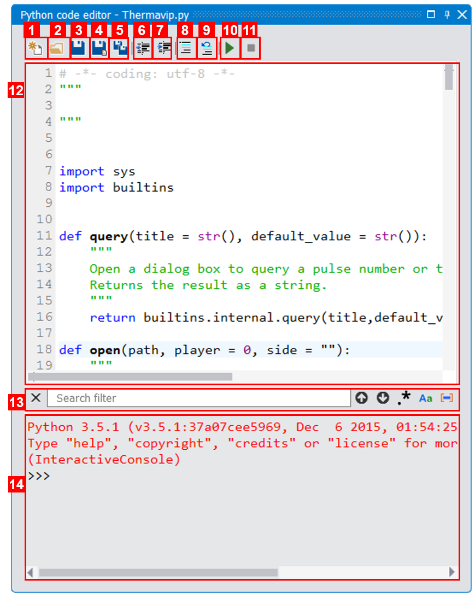

Python scripting
================

.. |python_editor| image:: images/icons/start_streaming.png

Thermavip provides several ways to use custom Python scripts to process signals or interact with the main interface. To apply a Python script to one or multiple curves/images, see the :ref:`processing <processings>` section.

Thermavip also provides a minimal Python editor as a :ref:`tool widget <tools>`. Use the |python_editor| icon from the main tool bar to show it:

.. _python_editor:  

   
   *Thermavip Python editor*

1. Create new file,
2. Open Python file,
3. Save current file,
4. Save current file as,
5. Save all files,
6. Unindent selected lines,
7. Indent selected lines,
8. Comment selected lines,
9. Uncomment selected lines,
10. Save and Run current file,
11. Stop running file,
12. Python code editor,
13. Search panel, open with CTRL+F,
14. Python console. The Python file is launch within this console.

When saving a new file, the default path is the *Scripts* one within the *Thermavip* user folder (usually ~/.thermavip/Python/Scripts on linux). If you save the Python file inside the *Scripts* folder, it will be available as a shortcut from the |python_editor| button from the main tool bar (press the bottom arrow).

Any Python code could be launched from the Python editor, but its main goal is to run code that interact with the main Thermavip interface.
For this purpose, the *Thermavip* Python module is provided with the following functions:

.. code-block:: python

	# -*- coding: utf-8 -*-

	import sys
	import builtins

	PLOT_PLAYER = 0 # a 2D player containing curves, histograms,...
	VIDEO_PLAYER = 1 # a 2D player displaying an image or a video
	_2D_PLAYER = 2 # other type of 2D player
	OTHER_PLAYER = 3 # other type of player

	def player_type(player):
		"""
		Returns type of given player (one of PLOT_PLAYER, VIDEO_PLAYER, _2D_PLAYER, OTHER_PLAYER)
		"""
		return builtins.internal.player_type(player)

	def item_list(player, selection = 2, name=str()):
		"""
		Returns the list of available items (images, curves...) within given player that partially match given name (all items if name is empty).
		If selection != 2, returns all selected (if selection == 1) or unselected (if selection == 0) items.
		"""
		return builtins.internal.item_list(player,selection,name)

	def set_selected(player, selected , name=str()):
		"""
		Select or unselect an item in given player.
		The item is found based on given partial name.
		"""
		return builtins.internal.set_selected(player,selected,name)

	def unselect_all(player):
		"""
		Unselect all items in given player.
		"""
		return builtins.internal.unselect_all(player)

	def query(title = str(), default_value = str()):
		"""
		Open a dialog box to query a pulse number or time range depending on the plugins installed.
		Returns the result as a string.
		"""
		return builtins.internal.query(title,default_value)

	def open(path, player = 0, side = ""):
		"""
		Open given path in a new or existing player.
		The path could be a video/signal file or a signal from a database (like WEST and ITER ones).
		
		When called with one argument, the path is opened on a new player within the current workspace.
		
		If player is not 0, the path will be opened in an existing player with given ID.
		
		Optionally, you might specify a side to open the path around an existing player, and therefore
		create a multiplayer. The side argument could be either 'left', 'right', 'top' or 'bottom'.
		
		Returns the ID of the player on which the path was opened. Throw an exception on error.
		"""
		return builtins.internal.open(path,player,side)

	def close(player):
		"""
		Close the player within given ID.
		"""
		return builtins.internal.close(player)

	def show(player):
		"""
		Restaure the state of a player that was maximized or minimized.
		"""
		return builtins.internal.show_normal(player)

	def maximize(player):
		"""
		Show maximized given player.
		"""
		return builtins.internal.show_maximized(player)

	def minimize(player):
		"""
		Minimize given player.
		"""
		return builtins.internal.show_minimized(player)

	def workspace(wks = 0):
		"""
		Create or switch workspace.
		If wks is 0, create a new workspace and returns its ID. The current workspace is set to the new one.
		If wks is > 0, the function set the current workspace to given workspace ID.
		Returns the ID of the current workspace, or throw an exception on error.
		"""
		return builtins.internal.workspace(wks)

	def workspaces():
		"""
		Returns the list of all available workspaces.
		"""
		return builtins.internal.workspaces()

	def current_workspace():
		"""
		Returns the ID of current workspace.
		"""
		return builtins.internal.current_workspace()

	def workspace_title(wks):
		"""
		Returns the workspace title for given index
		"""
		return builtins.internal.workspace_title(wks)

	def set_workspace_title(wks, title):
		"""
		Set the workspace title for given index
		"""
		return builtins.internal.set_workspace_title(wks,title)

	def reorganize():
		"""
		Reorganize all players within the current workspace in order to use all the available space.
		"""
		return builtins.internal.reorganize()

	def time():
		"""
		Returns the current time in nanoseconds within the current workspace.
		"""
		return builtins.internal.time()

	def set_time(time, ref = 'absolute'):
		"""
		Set the time (in nanoseconds) in current workspace.
		If ref == 'relative', the time is considered as an offset since the minimum time of the workspace.
		"""
		return builtins.internal.set_time(time,ref)

	def next_time(time):
		"""
		Returns the next valid time (in nanoseconds) for the current workspace.
		Returns an invalid time if no next time can be computed.
		"""
		return builtins.internal.next_time(time)

	def previous_time(time):
		"""
		Returns the previous valid time (in nanoseconds) for the current workspace.
		Returns an invalid time if no previous time can be computed.
		"""
		return builtins.internal.previous_time(time)

	def closest_time(time):
		"""
		Returns the closest valid time (in nanoseconds) for the current workspace.
		Returns an invalid time if no closest time can be computed.
		"""
		return builtins.internal.closest_time(time)

	def is_valid_time(time):
		"""
		Returns True if given time is valid, False otherwise.
		"""
		return time != -9223372036854775807

	def time_range():
		"""
		Returns the time range [first,last] within the current workspace.
		"""
		return builtins.internal.time_range()

	def clamp_time( xy, min_time, max_time):
		"""
		Clamp input signal to remove samples outside [min_time,max_time] interval.
		Input array should be a 2d numpy array of shape (2, number_of_samples)
		The first row should contain time values and the second row the sample values.
		"""
		return builtins.internal.clamp_time(xy,min_time,max_time)

	def set_stylesheet(player, stylesheet, data_name = ""):
		"""
		Set the stylesheet for a curve/histogram/image within a player.
		The stylesheet is used to customize the look'n feel of a plot item (pen, brush, symbol, color map, 
		title, axis units,...)
		
		The plot item is found using the player ID and the plot item name. If no name is given, the 
		style sheet is applied to the first item found (normally the last inserted one). 
		Note that only a partial name is required. The stylesheet will be applied to the first item matching the partial name.
		
		the stylesheet a string value containing a CSS-like code. Example:
			
		   #Set the output curve style sheet
		   stylesheet = \
		   \"\"\"
		   pen: 1.5px dash red;
		   symbol:ellipse;
		   symbolsize: 7;
		   symbolborder: magenta;
		   symbolbackground: transparent;
		   title:'my new title';
		   \"\"\"
		   
		Note that each attribute is separated by a semicolon.
		   
		For any kind of item (image, curve, histogram,...) the style sheet defines the following attributes:
		
			1. renderhint: rendering property, one of 'antialiasing', 'highQualityAntialiasing' or 'noAntialiasing'
			2. color: the item global color. The color could be a predefined color (among 'black', 'white', 'red', 'darkRed', 'green', 'darkGreen', 'blue', 'darkBlue', 'cyan', 'darkCyan', 'magenta', 'darkMagenta', 'yellow', 'darkYellow', 'gray', 'darkGray', 'lightGray', 'transparent') or a custom one. A custom color is set through its RGBA values (like 'rgb(128,125,8)' or 'rgba(128,125,8,255)') or using its hexadecimal representation (like '#5634CC').
			3. border: the item outer pen. The pen is a combination of width (in pixels), style (among 'solid', 'dash', 'dot', 'dashdot' and 'dashdotdot') and color. Example:
				
				 border: 1.5px solid blue;
		
			   Note that the pen can contain any combination of width, style and color. At least one value (a color, a width or a style) is mandatory.
			4. selectionborder: the pen used when the item is selected.
			5. background: the background color.
			6. selected: a boolean value (either '0', '1', 'true' or 'false') telling if the item is selected or not.
			7. visible: a boolean value (either '0', '1', 'true' or 'false') telling if the item is visible or not.
			8. tooltip: a string value representing the item tool tip (displayed when hovering the item).
			9. title: the item's title.
			10. axisunit: the unit of given axis. Example for a curve:
				
				axisunit[0]: 'time'; /*set the X unit*/ 
				axisunit[1]: 'MW'; /*set the Y unit*/ 
		
			11. text: additional text to display on top of the curve. You can define as many additional texts as you need using the *[]* operator. In addition to the text string, you can define the the optional text color and background color:
						
					text[0] : 'my first text' red blue; /*Red text on blue background*/
					text[1] : 'my second text'; /*simple black text*/
					
					/*Set the first text position and alignment*/
					textposition[0]: xinside|yinside;
					textalignment[0]: top|right;
			
			12. textposition: position of additional text as regards to the item bounding rect. Could be a combination of *outside*, *xinside*, *yinside*, *inside*, *xautomatic*, *yautomatic*, *automatic*, with a '|' separator. 
			13. textalignment: additional text alignment, combination of *left*, *right*, *hcenter*, *top*, *bottom*, *vcenter*, *center*, with a '|' separator.
		
		Curves define the following additional attributes:
		
		1. style: style of the curve line, one of 'noCurve', 'lines', 'sticks', 'steps', 'dots'.
		2. attribute: additional curve attributes, combination of 'inverted' (for steps only), 'closePolyline' (join first and last curve points).
		3. symbol: the symbol style, on of 'none' (no symbol, default), 'ellipse', 'rect', 'diamond', ''triangle', 'dtriangle', 'utriangle', 'rtriangle', 'ltriangle', 'cross', 'xcross', 'hline', 'vline', 'star1', 'star2', 'hexagon'.
		4. symbolsize: width and height of the symbol.
		5. symbolborder: outer pen of the symbol.
		6. symbolbackground: inner color of the symbol.
		7. baseline: curve baseline value (only used if a background color is set with the 'background' property).
		
		Images define the following additional attributes:
		
		1. colormap: the spectrogram color map, one of 'autumn', 'bone', 'cool', 'copper', 'gray', 'hot', 'hsv', 'jet', 'fusion', 'pink', 'spring', 'summer', 'white', 'winter'.
		   

		"""
		return builtins.internal.set_stylesheet(player, stylesheet,data_name)

	def top_level(player):
		"""
		For given player ID inside a multi-player, returns the ID of the top level window.
		This ID can be used to maximize/minimize the top level multi-player.
		"""
		return builtins.internal.top_level(player)

	def get(player, data_name = ""):
		"""
		Returns the data (usually a numpy array) associated to given player and item data name.
		The plot item is found using the player ID and the plot item name. If no name is given, the 
		first item data found is retuned. Note that only a partial name is required.
		The returned data will be the one of the first item matching the partial name.
		"""
		return builtins.internal.get(player,data_name)

	def get_attribute(player, attribute_name, data_name = ""):
		"""
		Returns the data attribute associated to given player and item data name.
		The plot item is found using the player ID and the plot item name. If no name is given, the 
		first item data found is retuned. Note that only a partial name is required.
		The returned attribute will be the one of the first item matching the partial name.
		"""
		return builtins.internal.get_attribute(player,attribute_name,data_name)

	def get_attributes(player, data_name = ""):
		"""
		Returns the attributes associated to given player and item data name.
		The plot item is found using the player ID and the plot item name. If no name is given, the 
		first item data found is retuned. Note that only a partial name is required.
		"""
		return builtins.internal.get_attributes(player,data_name)

	def set_attribute(player, attribute_name, attribute_value, data_name = ""):
		"""
		Set the data attribute associated to given player and item data name.
		The plot item is found using the player ID and the plot item name. If no name is given, the 
		first item data found is retuned. Note that only a partial name is required.
		"""
		return builtins.internal.set_attribute(player,attribute_name,attribute_value, data_name)

	def get_roi(player, group, roi_id, yaxis = ""):
		"""
		Returns the ROI polygon associated to given player, ROI group (usually 'ROI', 'Polylines' or 'Points')
		and ROI identifier.
		For plot player only, yaxis specifies on which left scale to search for the ROI (in case of stacked plots).
		"""
		return builtins.internal.get_roi(player,group,roi_id,yaxis)

	def get_roi_filled_points(player, group, roi_id):
		"""
		Returns the ROI covered points associated to given video player, ROI group (usually 'ROI', 'Polylines' or 'Points')
		and ROI identifier.
		"""
		return builtins.internal.get_roi_filled_points(player,group,roi_id)

	def clear_roi(player, yaxis = ""):
		"""
		Remove all ROIs (as well as annotations) in given player.
		For plot player only, yaxis specifies on which left scale to search for the ROI (in case of stacked plots).
		"""
		return builtins.internal.clear_roi(player,yaxis)

	def add_roi(player, roi,yaxis = ""):
		"""
		Add a ROI inside given player based on a filename or a list of points.
		For plot player only, yaxis specifies on which left scale to search for the ROI (in case of stacked plots).
		The roi argument could be:
			- A 2D array (first row is polygon y, second is polygon x)
			- A list of 1D arrays (first index is polygon y, second is polygon x)
			- A ROI filename (usualy a xml file)
			
		If given polygon has one point only, it creates a point ROI (group 'Points').
		If given polygon does not end with the first point, it creates a polyline (group 'Polylines').
		Otherwise, it creates a polygon ROI (group 'ROI').
		
		Returns a string containing 'group:roi_id'.
		"""
		return builtins.internal.add_roi(player,roi,yaxis)

	def time_trace(roi_player, rois, **kwargs ):
		"""
		Extract the ROI(s) time trace.
		player is the input video player.
		rois is the list of ROIs (list of string of the form 'ROI_group:ROI_id') to extract the time trace from.
		
		This function can take extra arguments:
			 - 'skip': number of frames to skip (1 out of skip). Default to 1.
			 - 'multi': management of several shapes: 0 = union of all shapes, 1 = intersection, 2 = compute time traces separately (default).
			 - 'player' : output plot player id.
			 - 'statistics' : string that can mix 'min', 'max', 'mean' (like 'max|mean')
			 
		Returns the id of output plot player
		"""
		return builtins.internal.time_trace(roi_player,rois,kwargs)

	def remove(player, data_name):
		"""
		Remove, from given palyer, all plot items matching given (potentially partial) data name.
		Returns the number of item removed.
		"""
		return builtins.internal.remove(player,data_name)

	def set_time_marker(player, enable):
		"""
		Show/hide the time marker for given plot player.
		"""
		return builtins.internal.set_time_marker(player,enable)

	def zoom(player, x1, x2, y1 = 0, y2 = 0, unit = ""):
		"""
		Zoom/unzoom on a specific area for a video/plot player.
		
		The zoom is applied on the rectangle defined by x1, x2, y1 and y2.
		If x1 == x2, the zoom is only applied on y component.
		If y1 == y2, the zoom is only applied on x component.
		
		For a plot player with multiple stacked y scales, the unit parameter
		tells which y scale to use for the zoom.
		
		Note that, for plot players displaying a time scale, the x values provided
		should be in nanoseconds.
		"""
		return builtins.internal.zoom(player,x1,x2,y1,y2,unit)

	def set_color_map_scale(player, vmin, vmax, gripMin = 0, gripMax = 0):
		"""
		Change the color map scale for given video player.
		
		vmin and vmax are the new scale boundaries. If vmin == vmax, the current
		scale boundaries are kept unchanged.
		
		gripMin and gripMax are the new slider grip boundaries. If gripMin == gripMax,
		the grip boundaries are kept unchanged.
		"""
		return builtins.internal.set_color_map_scale(player,vmin,vmax,gripMin,gripMax)

	def x_range(player):
		"""
		For given plot player, returns the list [min_x_value, max_x_value] for the union of all visible curves.
		"""
		return builtins.internal.x_range(player)

	def auto_scale(player, enable):
		"""
		Enable/disable automatic scaling for given player
		"""
		return builtins.internal.auto_scale(player, enable)

	def set_x_scale(player, minvalue, maxvalue):
		"""
		Set the min and max value of the bottom scale for given plot player
		"""
		return builtins.internal.set_x_scale(player, minvalue, maxvalue)

	def set_y_scale(player, minvalue, maxvalue, unit=""):
		"""
		Set the min and max value of the Y scale for given plot player.
		If the player has multiple stacked Y scales, unit is used to find the right one.
		"""
		return builtins.internal.set_y_scale(player, minvalue, maxvalue,unit)

	def player_range(player):
		"""
		For plot player, returns the list [min, max] of the temporal scale.
		For video player, returns the list [min time,max time] of the underlying video device.
		"""
		return builtins.internal.player_range(player)

	def set_title(player,title):
		"""
		Set the given player title.
		"""
		return builtins.internal.set_title(player,title)

	def annotation(player,style,text,pos,**kwargs):
		"""
		Create an annotation inside given player.

		@param player player id
		@param style annotation style: 'line', 'arrow', 'rectangle', 'ellipse', or 'textbox'
		@param text annotation text
		@param pos annotation position on the form [y1,x1,y2,x2] for 'line', 'arrow', 'rectangle' and 'ellipse,
		or [y1,x1] for 'line' (single point) and 'textbox' (top left position of the text)
		@param kwargs additional annotation attributes:
			- "textcolor" : annotation text color (uses stylesheet mechanism)
			- "textbackground" : annotation text background color
			- "textborder" : annotation text outline (border box pen)
			- "textradius" : annotation text border radius of the border box
			- "textsize" : size in points of the text font
			- "bold" : use bold font for the text
			- "italic" : use italic font for the text
			- "fontfamilly": font familly for the text
			- "border" : shape pen
			- "background" : shape brush
			- "distance" : distance between the annotation text and the shape
			- "alignment" : annotation text alignment around the shape (combination of 'left', 'right', 'top', 'bottom', 'hcenter', vcenter', 'center')
			- "position" : text position around the shape (combination of 'xinside', 'yinside', 'inside', 'outside')
			- "symbol" : for 'line' only, symbol for the end point (one of 'none', 'ellipse', 'rect', 'diamond', 'triangle', 'dtriangle', 'utriangle', 'ltriangle', 'rtriangle', 'cross', 'xcross', 'hline', 'vline', 'star1', 'star2', 'hexagon')
			- "symbolsize" : for 'line' and 'arrow', symbol size for the end point

		Returns the annotation id on success.
		"""
		return builtins.internal.annotation(player,style,text,pos,kwargs)

	def remove_annotation(annotation_id):
		"""
		Remove annotation with given id
		"""
		return builtins.internal.remove_annotation(annotation_id)

	def clear_annotations(player, all_annotations = False):
		"""
		Clear annotation for given player.
		If all_annotations is False, only annotations created with Python function annotation() are cleared.
		Otherwise, all annotations (including manual ones) are removed.
		"""
		return builtins.internal.clear_annotations(player,all_annotations)

	def imshow(array,**kwargs):
		"""
		Display an image in a new or existing player.
		@param array the numpy image
		@param kwargs additional arguments:
			- 'title': the image title
			- 'unit': image unit (as displayed on the colorbar)
			- 'player': output player id (display in an existing player). A value of 0 means to create a new player.
			
		Returns the output player id on success.
		
		To control more features on how the image is displayed, use the stylesheet mechanism.
		"""
		return builtins.internal.imshow(array,kwargs)

	def plot(xy,**kwargs):
		"""
		Plot a xy signal.
		@param xy the signal to plot. It must be a 2D array or list of [x,y].
		@param kwargs additional arguments:
			- 'title': the plot title
			- 'unit': the plot Y unit
			- 'xunit': the plot X unit
			- 'player': output player id (display in an existing player). A value of 0 means to create a new player.
			- 'symbol': point symbol (see set_stylesheet function for more details)
			- 'symbolsize': point symbol size (see set_stylesheet function for more details)
			- 'symbolborder': point symbol border color (see set_stylesheet function for more details)
			- 'symbolbackground': point symbol background color (see set_stylesheet function for more details)
			- 'border': curve border color (see set_stylesheet function for more details)
			- 'background': curve background color (see set_stylesheet function for more details)
			- 'style': curve style (see set_stylesheet function for more details)
			- 'color': curve and symbol color all at once (see set_stylesheet function for more details)
			- 'baseline': curve baseline value used to draw the background (if any) (see set_stylesheet function for more details)
			
		Returns the output player id on success.
		
		To control more features on how the curve is displayed, use the stylesheet mechanism.
		"""
		return builtins.internal.plot(xy,kwargs)

	def plots(xys,**kwargs):
		"""
		Plot several xy signals in one pass.
		The arguments are the same as for plot function, but all of them must be a list of N elements, even the attributes.
		Returns a list of player id (one per curve).
		"""	
		return builtins.internal.plots(xys,kwargs)

	def add_function(player, fun, function_name, item_name = str()):
		"""
		Add a function that will be applied in the object processing list.
		The function will be displayed in the processing list with given name.
		Use item_name to distinguish between curves.
		The function signature should be: def my_fun(data):->return data
		"""
		return builtins.internal.add_function(player, fun, function_name, item_name)

	def get_function(player, function_name, item_name = str()):
		"""
		Returns a function object set with add_function
		"""
		return builtins.internal.get_function(player, function_name, item_name)

	def add_widget_to_player(player, widget, side):
		"""
		Add a widget (from PySide2 or PyQt5) to a side of given player.
		side could be one of 'left', 'right', 'top', 'bottom'.
		"""
		import time
		millis = int(round(time.time() * 1000))
		oname = widget.objectName()
		wname = str(millis)
		widget.setObjectName(wname)
		builtins.internal.add_widget_to_player(player, side, wname, oname,widget)
		widget.show()

	def test_pid(pid):
		 return builtins.internal.test_pid(pid)

   
The sample code below uses these functions to open several signals within a new workspace (example on WEST). The code opens several signals displayed on 4 :ref:`players <players>` organized in a 2*2 grid. A :ref:`style sheet <stylesheets>` is used to customize the look & feel of the last signal.

.. code-block:: python

	import Thermavip as th

	pulse  = th.query("toto")

	#create a new workspace
	th.workspace()

	#open several signals
	player = th.open(pulse+";GPHYB")
	th.open(pulse+";GPREFLC1",player)
	th.open(pulse+";Camera1",player,"left")
	player_imag = th.open(pulse+";SMAG_IP",player,"bottom")
	player = th.open("38000;6",player_imag,"right")

	#maximize top level window
	th.maximize(th.top_level(player))

	#set current time
	th.set_time(10000000000) #10s

	#set stylesheet for on signal
	th.set_stylesheet(player_imag,"SMAG", \
	"""
	pen: 1.5px dash red;
	brush: rgba(255,0,0,127);
	baseline: 0;
	symbol:Ellipse;
	symbol-size: 7;
	symbol-pen:magenta;
	symbol-brush:transparent;
	title:'toto'
	"""
	)

