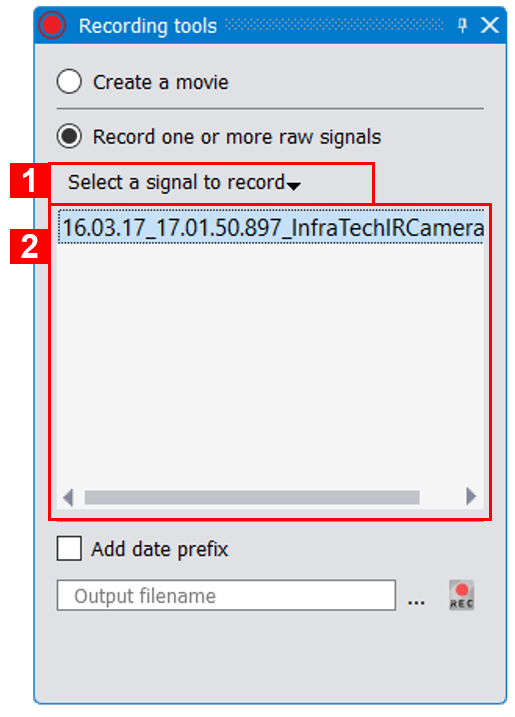
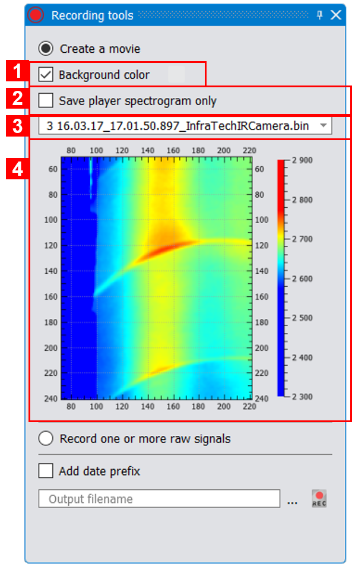

.. _saving: 

Saving signals and generating videos
====================================

----------------------------------------------
Saving curves/raw images
----------------------------------------------

.. |save_icon| image:: images/icons/save.png
.. |save_toolbar_icon| image:: images/icons/save_toolbar.png

To save a raw image (in ascii format or any other supported file formats), simply click on the |save_icon| icon from the video player tool bar.
Same way, to save a curve's content, simply click on the |save_icon| icon from the plot player tool bar and select the curve to save. It is also possible to save all signals in the same file. In this case, the file will contain one column for the X (time) values and one row for each signal. 
Note that all signals will be resampled in order to share the same X values. 
Only the CSV format stores the curve units.

You can also save the content of a plot/video player as a PNG or JPEG image. For that, click on the |save_toolbar_icon| icon from the player **title bar** (above the player tool bar).

----------------------------------------------
Saving dynamic curves and videos
----------------------------------------------

.. |record_icon| image:: images/icons/record_icon.png

Thermavip can save any kind of temporal signals (curves, images, histograms, ...) and generate videos through the Record :ref:`tool widget <tools>`.
To display the Record tool widget, check the |record_icon| icon in the main window tool bar (element (3) in :numref:`Fig. %s <main_window>`).

This tool widget looks like this:

.. _record:  

.. figure:: images/record.png
   :alt: Record tool widget
   :figclass: align-center
   :align: center
   :scale: 50%
   
   *Record tool widget*
   
1. Select whether you want to save raw signals or create a video (like MPEG ones). Depending on your choice, the displayed options will be different.
2. Checking this option will add a prefix to the output file name containing the data time when the recording starts.
3. The output file. Use the '...' button to browse the file system.
4. Launch the recording.

-----------------------
Saving temporal signals
-----------------------

To save raw signals, select the *Record on or more signals* option. The Record tool widget will then look like this:

   
   *Record one or multiple signals*
   
1. Select, from this button, the different signals you wish to record. This button displays a list of all available signals within the current workspace.
   You can also add a signal by clicking on its visual representation (for instance clicking on a curve or an image). Selected signals will be added to the signal list (2).
2. List of signals to record. Use the signal selector (1) to add signals. You can remove a signal previously added with the SUPPR key.

When launching the recording, the behavior might be different depending on the selected signals types:

1. If only :ref:`temporal <playing>` signals are selected, the recording will start immediately and a progress bar will be displayed until the end of saving.
2. If only :ref:`sequential <playing>` signals (streaming) are selected, the recording will start immediately and any new incoming frame will be recorded until you uncheck the |start_record_icon| icon.
3. You cannot mix temporal and sequential signals.

Note that if you select multiple signals, only one file format in Thermavip can save them in a unique archive. This is the ARCH format (.arch files).

.. _generate_video: 

-----------------------
Generating a video
-----------------------

To generate a video, select the *Save a video movie* option. The Record tool widget will then look like this:

   
   *Genereate a video*

1. Background color of the video. If checked, use the right button to change the background color. If unchecked, the recorder will try to generate the video with a transparent color.
2. Save the spectrogram only, without the axes and the color map (for video player only).
3. Select a player's content to record. This also works for multi-players. The generated video will contain the player's content with the actual player size.
4. A small screenshot of the selected player.

When launching the recording, the behavior might be different depending on the selected signals types:

1. You cannot mix :ref:`temporal and sequential <playing>` players.
2. If the selected player only contains :ref:`temporal <playing>` signals, the recording will start immediately and a progress bar will be displayed until the end of saving.
3. If the selected player only contains :ref:`sequential <playing>` (streaming) signals, the video generation will start immediately and a new image will be recorded every 20ms until you uncheck the |start_record_icon| icon. You can change the time between 2 consecutive image saving. 

By default, Thermavip can only save movies in multiple image files (.PNG, .JPG,...) in the same directory, or as a single image file containing a stack of images.
In most cases, Thermvip is shipped with the *Ffmpeg* plugin in order to create video files in standard formats (MPEG, WMV, AVI, MP4,...).

