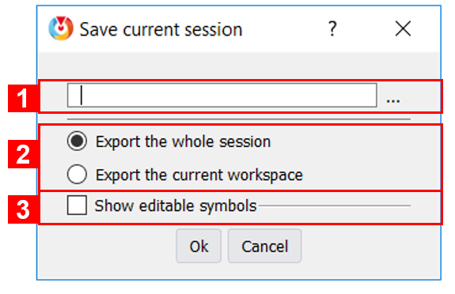
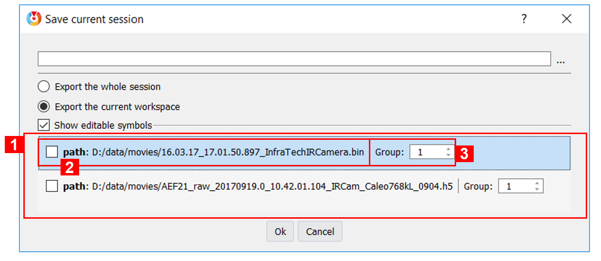

.. _session: 

Saving and reloading sessions
=============================

.. |save_icon| image:: images/icons/save.png
.. |open_file_icon| image:: images/icons/open_file.png

In Thermavip, saving a session means saving in a single file (*.session* file) all opened players with their sizes, positions, parameters, etc. The file also contains the positions and sizes of the different :ref:`tool widgets <tools>`, as well as their dock area (if any).

------------------------
Save the current session
------------------------

To save a session, just click on the |save_icon| icon in the main window tool bar (element (2) in :numref:`Fig. %s <main_window>`).
You will be prompted with the following dialog box:

.. _save_session:  

   
   *Save session dialog box*
   
1. The output session file name. The default output directory is always the *Perspectives* one. Saving the session in this folder will make the reloading easier (see :ref:`next section <reload_session>` ).
2. Select whether you want to save the full session (all workspaces) or only the current :ref:`workspace <workspaces>`. When loading back a full session, all your workspaces will be closed first. When loading back a workspace, it will be added to your workspace list.
3. Display the editable symbols. This feature will be explaind :ref:`after <customized_session>`.

.. _reload_session:  

------------------------
Reload a session
------------------------

To load back a session, just click on the |open_file_icon| icon in the main window tool bar (element (2) in :numref:`Fig. %s <main_window>`), and select your session file.
If you saved the session file in the *Perspectives* folder, just click on the small arrow on the right of the |open_file_icon| icon, and select your session file.

.. _customized_session:  

---------------------------
Create a customized session
---------------------------

It is possible to save customized sessions in Thermavip.

You might want, for instance, to save a session with a video and a set of Regions of Interest (ROIs) inside. And you might need to load back this session, keep the ROIs but on a different movie.
This behavior is possible through the means of editable symbols.

When saving your session, check the *Show editable symbols* option:

   
   *Save a customized session*
   
1. This area displays the list of available editable symbols. Edtable symbols are saved in the session file like any other ones, but can be modified while loading back the session.
   In this case, we save a session with 2 video players. Therefore, 2 editable symbols are available: the video file paths. Check the symbols you wish to modify when loading back the session file.
2. An editable symbol. It is divided in 2 parts:
	
	1. A check box with the name and the default content of the symbol. Check the symbol to make it editable when loading.
	2. The symbol group. When loading back, all symbols with the same group Id will be edited all at once with the same editor. You will have as many editors as the number of different group Ids.
	
In this case, if only checking the first symbol, you will be prompted with the following dialog box when loading back the session:

.. figure:: images/edit_session.png
   :alt: Edit session
   :figclass: align-center
   :align: center
   :scale: 80%
   
   *Reload a customized session*
   
The path symbol is filled with its default value. You can click on the '...' button to load a different file of the same type.
